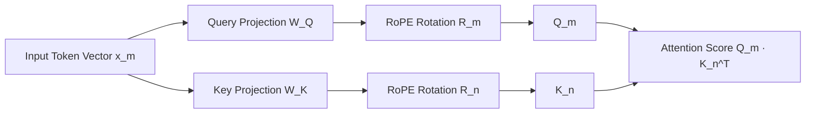

# I. Token Embeddings, Input Processing, & Rotary Position Embeddings (RoPE)

Before sequence data enters a Transformer block, discrete text tokens must be mapped into continuous high-dimensional vector spaces and augmented with positional information. Modern architectures (such as Llama 3) have abandoned additive absolute positional embeddings in favor of relative, multiplicative rotary transformations.

---

## 1. Tokenization & High-Dimensional Vector Embeddings

### Functional Rationale & Mechanics
Language models do not process raw text string sequences directly. Text is first decomposed by a **Tokenizer** into a sequence of discrete integer token IDs $t_{1:L} \in \mathbb{N}^L$ from a pre-defined vocabulary $V$.

To map these discrete indices into a continuous representation, the model uses an embedding lookup matrix $W_{\text{embed}} \in \mathbb{R}^{|V| \times d_{\text{model}}}$.

Input Text: "Motion Planning"
│
▼
[ Tokenizer ] ──> Token IDs: [14205, 48192]  (Discrete Indices)
│
▼
[ Lookup Matrix W_embed ]  (|V| × d_model)
│
▼
Embedding Tensor X0  [B, L, d_model]  (Continuous Space)

### Mathematical Formulation
For a batch of sequences with token indices $t_{b, p} \in \{1, \dots, |V|\}$ at batch index $b$ and sequence position $p$:

$$x_{b, p}^{(0)} = \text{OneHot}(t_{b, p}) W_{\text{embed}} \in \mathbb{R}^{d_{\text{model}}}$$

Where:
* $|V|$ is the vocabulary size (e.g., $128,000$ in Llama 3).
* $d_{\text{model}}$ is the hidden dimension of the network (e.g., $4,096$).
* $X^{(0)} \in \mathbb{R}^{B \times L \times d_{\text{model}}}$ is the initial continuous activation tensor fed into the first Transformer block.

### Embedding Scaling Factors
In original Transformer formulations (Vaswani et al., 2017) and certain modern variants (e.g., Gemma), token embeddings are scaled by $\sqrt{d_{\text{model}}}$ prior to position encoding:

$$x_{b, p}^{(0)} = \sqrt{d_{\text{model}}} \cdot \text{Embedding}(t_{b, p})$$

**Rationale:** As hidden dimension $d_{\text{model}}$ grows large, the expected norm of random init vectors decreases relative to dot-product magnitudes. Scaling by $\sqrt{d_{\text{model}}}$ aligns the magnitude of embedding activations with subsequent residual stream state expectations.

---

## 2. Positional Encoding: Absolute vs. Relative Needs

### The Permutation Invariance Problem
Standard self-attention computes output vectors via context-weighted sums over sequence positions:

$$\text{Attention}(Q, K, V) = \text{Softmax}\left(\frac{Q K^T}{\sqrt{d_k}}\right) V$$

Because matrix operations evaluate pairwise interactions across the entire sequence length simultaneously, **un-annotated self-attention is strictly permutation invariant**:

$$\text{Attention}(P Q, P K, P V) = P \cdot \text{Attention}(Q, K, V)$$

Where $P$ is a permutation matrix. Without positional encoding, the sequence `"Car hits tree"` produces the exact same token-level feature representations as `"Tree hits car"`.

### Evolution of Position Representations

Absolute Additive (Vaswani et al.) ────> Relative Learned (Shaw et al.) ────> Rotary / Relative Multiplicative (RoPE)
[x_t = embed(t) + pos_embed(m)]         [Add bias to Attn Scores S_ij]       [Rotate Q_m and K_n vectors in 2D planes]

1. **Absolute Additive Encodings (Sinusoidal or Learned):** 
   $$x_m = e_m + p_m$$
   * *Limitation:* Position representations are static. The model must learn relative distances ($m - n$) indirectly through absolute coordinate combinations, degrading generalization on unseen sequence lengths ($L_{\text{test}} > L_{\text{train}}$).
2. **Relative Position Encodings (RPE):**
   Injects relative distance offsets $R_{m-n}$ directly into the attention score matrix $S_{m,n} = Q_m K_n^T + Q_m R_{m-n}^T$.
   * *Limitation:* Introduces intermediate distance lookup matrices, increasing GPU memory overhead and breaking efficient FlashAttention hardware kernels.

---

## 3. Rotary Position Embeddings (RoPE)

### Core Concept & Mathematical Formulation
Introduced by Su et al. (2021) and standard in modern LLMs (Llama 3, Mistral, Qwen), **Rotary Position Embedding (RoPE)** encodes relative positional information by rotating the Query and Key vectors in complex 2D vector planes by an angle proportional to their absolute sequence index.

Instead of *adding* positional vectors to token embeddings at input ($x^{(0)}$), RoPE is applied **multiplicatively inside every attention layer** directly to Query and Key projections before computing attention scores.

### The Relative Distance Inner Product Property
RoPE is derived to satisfy a strict functional constraint: the inner product between Query at position $m$ and Key at position $n$ must be a function **only of their relative offset $(m - n)$** and their unpositioned projections $q_m, k_n$:

$$\langle \mathbf{R}_{\Theta, m}^d q_m, \mathbf{R}_{\Theta, n}^d k_n \rangle = g(q_m, k_n, m - n)$$

Where $\mathbf{R}_{\Theta, m}^d$ is an orthogonal rotation matrix applied at position $m$.

---

## 4. RoPE Mathematical Mechanics: 2D Planes to $d$-Dimensions

### 1. The 2D Rotation Operator
For a 2D Query vector $q = [q_1, q_2]^T \in \mathbb{R}^2$ at sequence position $m$, RoPE defines rotation matrix $R_{\theta, m}$:

$$R_{\theta, m} q = \begin{pmatrix} \cos(m\theta) & -\sin(m\theta) \\ \sin(m\theta) & \cos(m\theta) \end{pmatrix} \begin{pmatrix} q_1 \\ q_2 \end{pmatrix}$$

Using complex number notation ($q_1 + i q_2 \in \mathbb{C}$):

$$R_{\theta, m} (q_1 + i q_2) = (q_1 + i q_2) \cdot e^{i m \theta}$$

### 2. Generalization to $d_{\text{head}}$-Dimensional Vectors
A high-dimensional Query vector $q \in \mathbb{R}^{d_{\text{head}}}$ is decomposed into $d_{\text{head}} / 2$ independent 2-dimensional orthogonal sub-planes. Each 2D pair $j \in \{1, 2, \dots, d_{\text{head}}/2\}$ is rotated by position $m$ using a distinct frequency $\theta_j$:

$$\mathbf{R}_{\Theta, m}^{d_{\text{head}}} = \begin{pmatrix} 
\cos(m\theta_1) & -\sin(m\theta_1) & 0 & 0 & \cdots & 0 & 0 \\
\sin(m\theta_1) & \cos(m\theta_1) & 0 & 0 & \cdots & 0 & 0 \\
0 & 0 & \cos(m\theta_2) & -\sin(m\theta_2) & \cdots & 0 & 0 \\
0 & 0 & \sin(m\theta_2) & \cos(m\theta_2) & \cdots & 0 & 0 \\
\vdots & \vdots & \vdots & \vdots & \ddots & \vdots & \vdots \\
0 & 0 & 0 & 0 & \cdots & \cos(m\theta_{d/2}) & -\sin(m\theta_{d/2}) \\
0 & 0 & 0 & 0 & \cdots & \sin(m\theta_{d/2}) & \cos(m\theta_{d/2})
\end{pmatrix}$$

Where base frequencies $\theta_j$ follow an exponentially decaying progression across head dimensions:

$$\theta_j = 10000^{-2(j-1)/d_{\text{head}}}, \quad j \in \left\{1, 2, \dots, \frac{d_{\text{head}}}{2}\right\}$$

*(Note: In Llama 3, the base frequency constant is increased from $10,000$ to $500,000$ to support long contexts up to 128k tokens).*

---

## 5. Proof of the Relative Distance Property

To see why $Q_m K_n^T$ depends exclusively on relative distance $(m - n)$:

Let $q_m = W_Q x_m$ and $k_n = W_K x_n$. Apply RoPE rotations $\mathbf{R}_m$ and $\mathbf{R}_n$:

$$\tilde{q}_m = \mathbf{R}_{\Theta, m} q_m, \quad \tilde{k}_n = \mathbf{R}_{\Theta, n} k_n$$

The inner product scoring value $S_{m, n}$ becomes:

$$S_{m, n} = \tilde{q}_m^T \tilde{k}_n = (\mathbf{R}_{\Theta, m} q_m)^T (\mathbf{R}_{\Theta, n} k_n) = q_m^T \mathbf{R}_{\Theta, m}^T \mathbf{R}_{\Theta, n} k_n$$

Because rotation matrices are orthogonal ($\mathbf{R}^T \mathbf{R} = I$) and rotation group addition holds ($\mathbf{R}_a \mathbf{R}_b = \mathbf{R}_{a+b}$):

$$\mathbf{R}_{\Theta, m}^T \mathbf{R}_{\Theta, n} = \mathbf{R}_{\Theta, -m} \mathbf{R}_{\Theta, n} = \mathbf{R}_{\Theta, n - m}$$

Substituting back yields:

$$S_{m, n} = q_m^T \mathbf{R}_{\Theta, n - m} k_n$$

> **Key Result:** The attention inner product depends strictly on unpositioned projections $q_m, k_n$ transformed by a rotation matrix corresponding to relative distance $(n - m)$. No absolute coordinates remain in the dot product.

---

## 6. Efficient In-Place Implementation (No Matrix Multiplication)

Constructing a explicit sparse $d \times d$ matrix $\mathbf{R}_{\Theta, m}^d$ for every token would be prohibitively slow ($O(d^2)$ operations per token). 

Instead, high-performance implementations compute RoPE via elementwise operations and vector slicing ($O(d)$ operations):

### Vector Slice Formulation
Given vector $x = [x_1, x_2, x_3, x_4, \dots, x_{d-1}, x_d]^T$:

Define helper vector $\text{rotate\_half}(x)$:

$$\text{rotate\_half}(x) = [-x_2, x_1, -x_4, x_3, \dots, -x_d, x_{d-1}]^T$$

The full rotary application is evaluated as:

$$\text{RoPE}(x, m) = x \odot \cos(m\Theta) + \text{rotate\_half}(x) \odot \sin(m\Theta)$$

Where $\odot$ represents elementwise (Hadamard) multiplication, and $\cos(m\Theta), \sin(m\Theta)$ are precomputed frequency vectors duplicated across 2D pairs.

Original Vector x:        [  x1,   x2,   x3,   x4 ]
rotate_half(x):           [ -x2,   x1,  -x4,   x3 ]
Cos Multiplier:           [ cos,  cos,  cos,  cos ]
Sin Multiplier:           [ sin,  sin,  sin,  sin ]

Result = (x ⊙ cos) + (rotate_half(x) ⊙ sin)

---

## 7. Mathematical Summary Table: Position Encodings

| Encoding Scheme | Injection Point | Operation Type | Relative Distance Property? | Extrapolation Beyond Max $L$? |
| :--- | :--- | :--- | :--- | :--- |
| **Sinusoidal (Vaswani)** | Input Embeddings $X^{(0)}$ | Additive ($x + p$) | Indirectly via linear maps | Poor |
| **Learned Absolute** | Input Embeddings $X^{(0)}$ | Additive ($x + p$) | No (Learned per position) | Impossible (Hard length cap) |
| **ALiBi (Press et al.)** | Attention Scores $S_{i,j}$ | Additive Bias ($-m \cdot |i-j|$) | Explicit penalty bias | Excellent |
| **RoPE (Su et al.)** | Queries/Keys inside Layer | Multiplicative (Rotation) | Exact ($q^T \mathbf{R}_{n-m} k$) | High (via Frequency Scaling) |