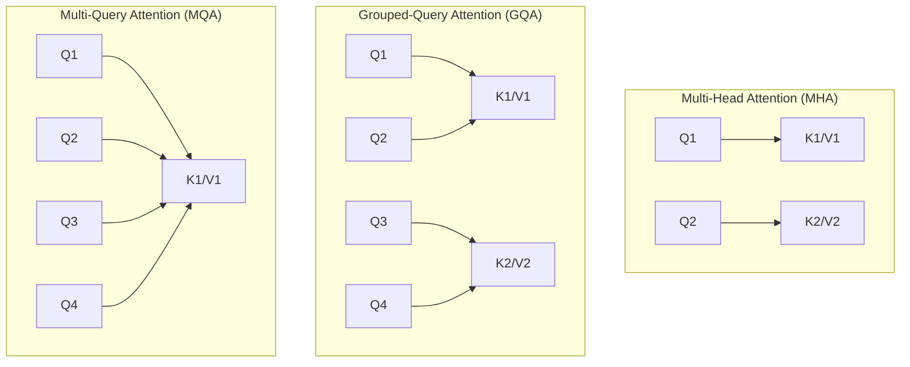

# IV. Structural Attention Variants: Handling KV Cache Limits

As demonstrated in Section III, the memory footprint of the Key-Value (KV) Cache grows linearly with batch size, sequence length, and network depth. In standard Multi-Head Attention (MHA), where every Query head possesses a dedicated Key and Value head, the KV cache footprint quickly dominates GPU memory, severely limiting context lengths and batch sizes during inference.

To bypass this memory wall without sacrificing performance, modern model families (Llama 3, Mistral, Gemma) replace standard MHA with **Structural Attention Variants**. These architectural adaptations modify how Key and Value projections are shared or constrained across attention heads.

## 1. Multi-Query Attention (MQA)

### Concept & Architectural Mechanics
Introduced by Shazeer (2019), **Multi-Query Attention (MQA)** reduces the memory bandwidth requirement of the KV cache to its absolute theoretical minimum for multi-head setups.

In standard MHA, for $h_Q$ Query heads, there are $h_{KV} = h_Q$ distinct Key and Value heads. In MQA, $h_Q$ independent Query heads share a **single** Key head and a **single** Value head ($h_{KV} = 1$).

$$\text{MHA: } W_K, W_V \in \mathbb{R}^{d_{\text{model}} \times (h_Q \cdot d_k)}$$

$$\text{MQA: } W_K, W_V \in \mathbb{R}^{d_{\text{model}} \times d_k}$$

During generation, each Query head $i \in \{1, \dots, h_Q\}$ computes attention against the exact same stored sequence of Keys and Values:

$$\text{head}_i = \text{Softmax}\left(\frac{Q_i \cdot \mathcal{K}_{\text{shared}}^T}{\sqrt{d_k}}\right) \mathcal{V}_{\text{shared}}$$

### KV Cache Memory Reduction Factor
By collapsing $h_{KV}$ from $h_Q$ to $1$, MQA reduces the memory footprint of the KV cache by a factor of $h_Q$:

$$\text{Memory Reduction Ratio} = \frac{\text{Memory}_{\text{MHA}}}{\text{Memory}_{\text{MQA}}} = \frac{h_Q}{1} = h_Q$$

For a model with 32 Query heads, MQA provides a **32-fold ($32\times$) reduction** in KV cache memory size and memory transfer overhead per decoding step.

### Trade-offs & Limitations
* **Pros:** Unlocks massive serving batch sizes; reduces memory bandwidth saturation during the decode phase.
* **Cons:** Severe drop in representation capacity and model quality. Forcing all Query heads to attend to identical Key/Value subspaces inhibits the model's ability to track disparate linguistic features concurrently (e.g., tracking subject-verb agreement and long-range coreference simultaneously). Training can also exhibit numerical instability.

---

## 2. Grouped-Query Attention (GQA)

### Concept & Architectural Mechanics
**Grouped-Query Attention (GQA)** (Ainslie et al., 2023) was designed to achieve a middle ground: capturing nearly all of MHA’s representation capacity while maintaining the speed and memory efficiency of MQA.

Instead of sharing 1 KV head across all $h_Q$ Query heads, GQA partitions $h_Q$ Query heads into $G$ equal groups. Each group of $g = h_Q / G$ Query heads shares a single Key and Value head:

$$h_{KV} = G = \frac{h_Q}{g}$$

Grouped-Query Attention (GQA) with h_Q = 8, h_KV = 2 (G = 2, Group Size g = 4):

Group 1 (Shares K1, V1):    [ Q_1 ] [ Q_2 ] [ Q_3 ] [ Q_4 ] ──> K_1 , V_1
Group 2 (Shares K2, V2):    [ Q_5 ] [ Q_6 ] [ Q_7 ] [ Q_8 ] ──> K_2 , V_2

For Query head $i$ belonging to group $g(i) = \lfloor \frac{i-1}{g} \rfloor + 1$:

$$\text{head}_i = \text{Softmax}\left(\frac{Q_i \cdot \mathcal{K}_{g(i)}^T}{\sqrt{d_k}}\right) \mathcal{V}_{g(i)}$$

### Linear Projection Dimensionality
* $W_Q \in \mathbb{R}^{d_{\text{model}} \times (h_Q \cdot d_k)}$
* $W_K, W_V \in \mathbb{R}^{d_{\text{model}} \times (h_{KV} \cdot d_k)} \quad \text{where } h_{KV} = \frac{h_Q}{g}$
* $W^O \in \mathbb{R}^{(h_Q \cdot d_k) \times d_{\text{model}}}$

### Comparative Benchmark (Llama 3 8B Setup)
* **$h_Q = 32$**, **$h_{KV} = 8$** ($G = 8$, Group size $g = 4$).
* **Memory Reduction Factor:** $\frac{h_Q}{h_{KV}} = \frac{32}{8} = 4\times$ reduction in KV cache size compared to MHA.
* **Quality Retention:** Retains $>99\%$ of MHA performance on benchmark tasks while dramatically increasing decoding throughput.

---

## 3. Sliding Window Attention (SWA / Local Attention)

### Concept & Architectural Mechanics
While GQA reduces the per-token memory overhead by scaling $h_{KV}$, the memory consumption still grows linearly with context length $L$. For multi-million token contexts, even GQA KV caches will eventually exhaust VRAM.

**Sliding Window Attention (SWA)** (Beltagy et al., 2020; popularized by Mistral 7B) addresses the sequence-length dimension $L$.

Instead of allowing a Query at position $t$ to attend to all past tokens $1 \dots t$, SWA constrains attention to a fixed local window of size $W$.

$$\text{Attention Mask: } M_{t, j} = \begin{cases} 0 & \text{if } t - W \le j \le t \\ -\infty & \text{otherwise} \end{cases}$$

Full Attention (Standard Causal):          Sliding Window Attention (W = 3):
Tokens: 1  2  3  4  5                      Tokens: 1  2  3  4  5
1    ■  .  .  .  .                         1    ■  .  .  .  .
2    ■  ■  .  .  .                         2    ■  ■  .  .  .
3    ■  ■  ■  .  .                         3    ■  ■  ■  .  .
4    ■  ■  ■  ■  .                         4    .  ■  ■  ■  .  <-- Token 1 masked out
5    ■  ■  ■  ■  ■                         5    .  .  ■  ■  ■  <-- Tokens 1, 2 masked out

### Receptive Field Expansion Across Stacked Layers
Even though a single layer only attends to $W$ local tokens, stacking $L_{\text{layers}}$ layers allows information to propagate across a much larger context.

At layer $l$, a token vector aggregate information from a window of $W$ tokens from layer $l-1$. Therefore, across $L_{\text{layers}}$ stacked layers, the **effective receptive field** $R_{\text{effective}}$ grows linearly with depth:

$$R_{\text{effective}} = L_{\text{layers}} \times W$$

Layer 3:  [   ] <─────── Receptive Field = 3 × W ───────> [   ]
│                                               │
Layer 2:  [   ] <───── Receptive Field = 2 × W ─────> [   ]
│                                           │
Layer 1:  [   ] <── Receptive Field = 1 × W ──> [   ]

#### Example:
In Mistral 7B ($L_{\text{layers}} = 32$, $W = 4096$), the effective theoretical receptive field reaches:

$$R_{\text{effective}} = 32 \times 4096 = 131,072 \text{ tokens}$$

### KV Cache Memory Bound
With SWA, the KV cache for each layer transformed into a **fixed-size circular buffer** of size $W$. Once the sequence length exceeds $W$, old Key/Value entries are overwritten.

$$\text{Memory}_{\text{KVCache, SWA}} = 2 \times B \times W \times N_{\text{layers}} \times h_{\text{KV}} \times d_{\text{head}} \times \text{BytesPerPrecision}$$

The memory cost becomes $O(W)$ instead of $O(L)$, decoupling the memory footprint from total context length.

---

## Comprehensive Structural Variant Matrix

| Feature / Metric | Multi-Head Attention (MHA) | Multi-Query Attention (MQA) | Grouped-Query Attention (GQA) | Sliding Window Attention (SWA) |
| :--- | :--- | :--- | :--- | :--- |
| **Key/Value Heads ($h_{KV}$)** | $h_{KV} = h_Q$ | $h_{KV} = 1$ | $1 < h_{KV} < h_Q$ | Depends on base block (MHA/GQA) |
| **KV Cache Size Ratio** | $1\times$ (Baseline) | $\frac{1}{h_Q}$ | $\frac{h_{KV}}{h_Q}$ (e.g., $\frac{1}{4}$ or $\frac{1}{8}$) | Bounded by $\frac{W}{L}$ ratio |
| **Per-Token Time Complexity** | $O(L)$ | $O(L)$ | $O(L)$ | $O(W)$ |
| **Max Memory Complexity** | $O(B \cdot L)$ | $O(B \cdot L)$ | $O(B \cdot L)$ | $O(B \cdot W)$ |
| **Primary Advantage** | Highest quality & capacity | Maximum KV compression | Optimal quality/speed trade-off | Bounded memory overhead |
| **Primary Disadvantage** | VRAM saturation at scale | Representation quality drop | Slightly higher compute than MQA | Loss of immediate direct long-range links |
| **Example Adopters** | Original Transformer, Llama 1/2 | Falcon, PaLM | Llama 3, Mistral, Qwen 2 | Mistral 7B |