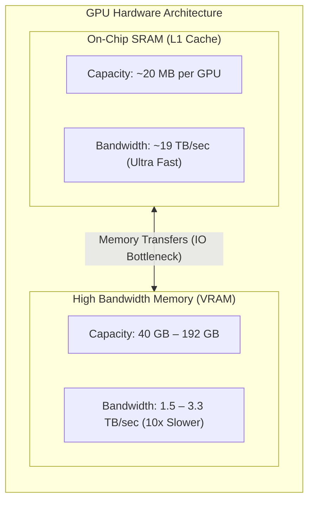
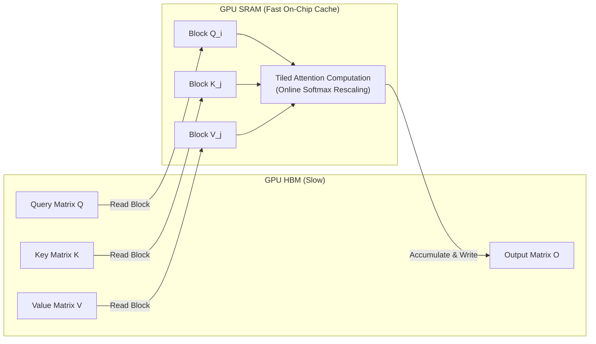

# V. Hardware-Aware Memory Management (FlashAttention & PagedAttention)

While structural variants like GQA and SWA modify model architectures to reduce KV cache size, **software-level memory innovations** optimize how GPU hardware handles attention memory transfers and VRAM allocation—without altering a single model parameter or weight matrix.

---

## 1. FlashAttention: IO-Awareness & SRAM Tiling

### The Memory Hierarchy Bottleneck
Modern GPU compute units (Tensor Cores) execute matrix multiplications at petaflop speeds. However, attention performance is often constrained not by arithmetic throughput (FLOPs), but by **Memory Bandwidth**—the speed at which data transfers between slow High Bandwidth Memory (HBM) and fast, on-chip SRAM.

In standard Multi-Head Attention, intermediate matrices $S = Q K^T \in \mathbb{R}^{L \times L}$ and $P = \text{Softmax}(S) \in \mathbb{R}^{L \times L}$ are explicitly calculated and written to HBM, then re-read back into SRAM to compute output $O = P V$.

$$\text{HBM Read/Write Overhead: } O(L^2) \quad \text{(Quadratic Memory IO)}$$

For large context lengths $L$, repeatedly loading $L \times L$ attention score matrices across the memory bus stalls execution units.

---

### Mechanics: Block Tiling & Online Softmax Scaling
FlashAttention (Dao et al., 2022/2023) eliminates quadratic HBM reads and writes by partitioning Query, Key, and Value matrices into smaller sub-blocks that fit entirely within fast **SRAM**.

The Online Softmax Numerical ChallengeStandard Softmax requires access to all sequence elements simultaneously to compute the global max normalization factor $m(x) = \max_j (x_j)$ and sum denominator $d(x) = \sum_j e^{x_j - m(x)}$:$$\text{Softmax}(x)_i = \frac{e^{x_i - m(x)}}{\sum_j e^{x_j - m(x)}}$$FlashAttention computes Softmax incrementally across blocks without materializing the full row. When moving from block $j^{(1)}$ to block $j^{(2)}$:Local row maximums are tracked: $m^{(1)}$ and $m^{(2)}$.New global max is updated: $m^{\text{new}} = \max(m^{(1)}, m^{(2)})$.Previous partial attention sums and outputs are rescaled dynamically:$$\text{Correction Factor: } \alpha = e^{m^{(1)} - m^{\text{new}}}$$$$d^{\text{new}} = e^{m^{(1)} - m^{\text{new}}} d^{(1)} + e^{m^{(2)} - m^{\text{new}}} d^{(2)}$$$$O^{\text{new}} = \frac{\alpha \cdot d^{(1)} \cdot O^{(1)} + e^{m^{(2)} - m^{\text{new}}} \cdot (P^{(2)} V^{(2)})}{d^{\text{new}}}$$Key Result: Attention is computed in a single GPU kernel pass with zero intermediate $L \times L$ HBM writes, reducing memory overhead from $O(L^2)$ to $O(L)$ while yielding identical exact outputs (not an approximation).2. PagedAttention: Eliminating KV Cache FragmentationThe Physical Memory Allocation ProblemIn standard LLM serving engines, GPU memory for a request's KV cache must be allocated in contiguous memory blocks. Because generation sequence lengths are non-deterministic, systems pre-allocate contiguous slots for the maximum possible context length (e.g., reserving space for $8,192$ tokens upfront).Contiguous Allocation (Standard Engine):
[ Token 1..100 Active ] [ Reserved Wasted Space (Unused 8092 Tokens) ] ──> Internal Fragmentation (up to 60-80%)
This traditional approach introduces severe VRAM inefficiencies:Internal Fragmentation: Memory reserved for tokens that have not yet been generated.External Fragmentation: Unusable memory gaps between different requests of varying sizes.Over-reservation: Limits overall system concurrency (batch size) during inference.Mechanics: Virtual Memory Paging for KV CacheInspired by virtual memory management in operating systems, PagedAttention (Kwon et al., 2023 / vLLM) partitions the KV Cache into fixed-sized, non-contiguous physical blocks (pages).Logical KV Cache (Sequence A):
[ Block 0 (Tokens 0-15) ] ──> [ Block 1 (Tokens 16-31) ] ──> [ Block 2 (Tokens 32-47) ]

                                   │ Block Table Mapping
                                   ▼

Physical Memory Pages (GPU VRAM):
[ Physical Page #12 : Seq A, Block 0 ]
[ Physical Page #03 : Seq B, Block 1 ]  <-- Interleaved Allocation
[ Physical Page #45 : Seq A, Block 2 ]
[ Physical Page #07 : Seq A, Block 1 ]
How It Works:Fixed Page Size: KV Cache tensors are split into small blocks (e.g., 16 tokens per block).Dynamic Block Table: A dynamic page table maps consecutive logical token positions to arbitrary non-contiguous physical pages in GPU VRAM.On-Demand Allocation: Physical memory pages are allocated only as new tokens are actively generated.Zero-Copy Memory Sharing: Complex decoding strategies (e.g., parallel sampling or beam search) share physical KV cache pages across different candidate branches via reference counting, copying a page only when modified (Copy-on-Write).3. Summary Comparison: Hardware & Memory InnovationsInnovationLevelCore Problem AddressedPrimary MechanismPrimary BenefitFlashAttentionCompute / ExecutionGPU HBM Memory Bandwidth BottlenecksSRAM Tiling & Online Softmax Rescaling$2\times - 4\times$ faster attention; $O(L)$ memory usagePagedAttentionMemory / ServingKV Cache Fragmentation & Over-reservationVirtual Memory Paging & Block Tables$2\times - 4\times$ throughput via near-zero VRAM waste
<ElicitationsGroup message="Where would you like to go next?">
  <Elicitation label="Review full 75-minute seminar agenda with Module A included" query="Generate the updated, full 75-minute seminar outline including Chapter I, II, III, IV, Module A, and Chapter V."/>
  <Elicitation label="Explore deep-dive code implementation for FlashAttention or PagedAttention" query="Provide a minimal PyTorch implementation demonstrating the online Softmax rescaling logic used in FlashAttention."/>
</ElicitationsGroup>
