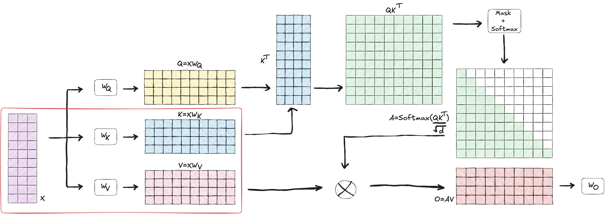
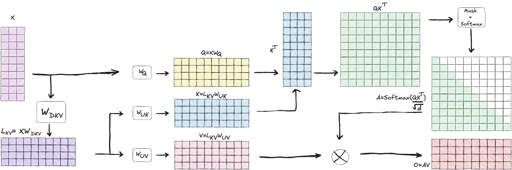
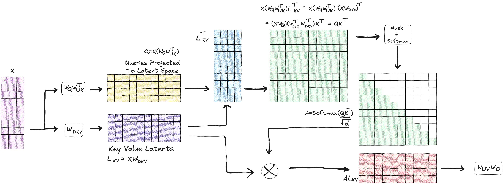
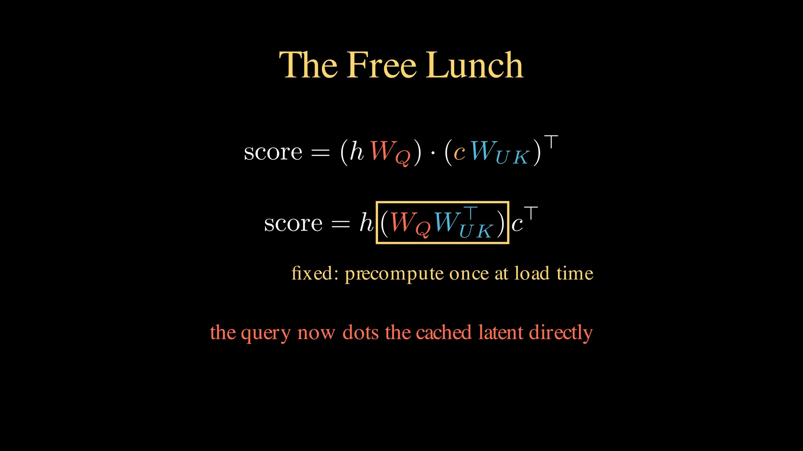
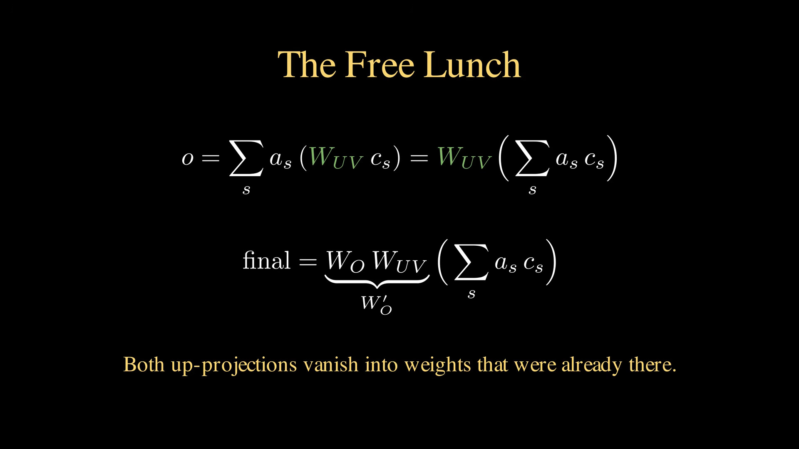

# Appendix C: Mathematical Mechanics of Weight Absorption in Multi-Head Latent Attention (MLA)

This appendix provides a rigorous mathematical derivation of Multi-Head Latent Attention (MLA) as used in modern architectures like DeepSeek-V2 and DeepSeek-V3. It details how low-rank latent compression reduces Key-Value (KV) cache memory footprint and how matrix re-association (weight absorption) eliminates the computational overhead of expanding keys and values during inference.

---

## 1. Symbol and Dimension Glossary

To ensure clarity throughout tensor operations, the following dimensions and notation are used:

| Symbol | Description | Typical Value (DeepSeek-V3) |
| --- | --- | --- |
| $d_{\text{model}}$ | Model hidden dimension | $7,168$ |
| $h_q$ | Number of Query attention heads | $128$ |
| $d_h$ | Dimension per attention head | $128$ |
| $d_c$ | KV low-rank compressed latent dimension | $512$ |
| $d_R$ | Decoupled RoPE positional head dimension | $64$ |
| $b$ | Batch size | Variable |
| $s$ | Context length / sequence length | Variable |

---

## 2. Standard Attention Setup (Unabsorbed)

In a standard Attention mechanism, a hidden state input vector at step $t$, denoted as $\mathbf{h}_t \in \mathbb{R}^{1 \times d_{\text{model}}}$, generates Query, Key, and Value projections.

For MLA, the Keys and Values for token $i$ are compressed into a single low-rank latent vector $\mathbf{c}_i^{KV} \in \mathbb{R}^{1 \times d_c}$ via a down-projection matrix $\mathbf{W}^{DKV} \in \mathbb{R}^{d_{\text{model}} \times d_c}$.

### Step-by-Step Unabsorbed Tensor Operations

1. **Query Content Projection (Head $n$):**

$$\mathbf{q}_{t,n}^C = \mathbf{h}_t \mathbf{W}_n^Q \quad \in \mathbb{R}^{1 \times d_h}$$

$$\text{Where } \mathbf{W}_n^Q \in \mathbb{R}^{d_{\text{model}} \times d_h}$$

2. **Key Content Up-Projection (Head $n$):**

$$\mathbf{k}_{i,n}^C = \mathbf{c}_i^{KV} \mathbf{W}_n^{UK} \quad \in \mathbb{R}^{1 \times d_h}$$

$$\text{Where } \mathbf{W}_n^{UK} \in \mathbb{R}^{d_c \times d_h}$$

3. **Content Attention Score Calculation (Unabsorbed):**
The unnormalized attention score $S_{t,i,n}^C$ between Query token $t$ and cached Key token $i$ for head $n$ is calculated via the inner product:
$$S_{t,i,n}^C = \mathbf{q}_{t,n}^C (\mathbf{k}_{i,n}^C)^T = \left(\mathbf{h}_t \mathbf{W}_n^Q\right) \left(\mathbf{c}_i^{KV} \mathbf{W}_n^{UK}\right)^T$$

Using the matrix transpose identity $(\mathbf{A} \mathbf{B})^T = \mathbf{B}^T \mathbf{A}^T$:
$$S_{t,i,n}^C = \left(\mathbf{h}_t \mathbf{W}_n^Q\right) (\mathbf{W}_n^{UK})^T (\mathbf{c}_i^{KV})^T$$

---

## 3. Mathematical Derivation of Key Weight Absorption

Before MLA:

Basic MLA:

MLA Absorption:

---
---

Because matrix multiplication is associative—$(\mathbf{A} \mathbf{B}) \mathbf{C} = \mathbf{A} (\mathbf{B} \mathbf{C})$—the model can re-associate the linear transformations before running autoregressive generation.

### Step 1: Pre-computing the Combined Query-Key Matrix ($\mathbf{W}_n^{Q'}$)

Prior to running inference, the Query projection matrix $\mathbf{W}_n^Q$ and the transposed Key up-projection matrix $(\mathbf{W}_n^{UK})^T$ are pre-multiplied together offline or during model load time:

$$\mathbf{W}_n^{Q'} = \mathbf{W}_n^Q (\mathbf{W}_n^{UK})^T \quad \in \mathbb{R}^{d_{\text{model}} \times d_c}$$

#### Tensor Dimension Verification:

$$\left[d_{\text{model}} \times d_h\right] \times \left[d_h \times d_c\right] \longrightarrow \left[d_{\text{model}} \times d_c\right]$$

---

### Step 2: Directly Projecting Queries into Compressed Latent Space

During the decode forward pass for token $t$, the hidden state $\mathbf{h}_t$ is multiplied directly by $\mathbf{W}_n^{Q'}$ to generate an absorbed Query vector $\mathbf{q}_{t,n}^{C'}$:

$$\mathbf{q}_{t,n}^{C'} = \mathbf{h}_t \mathbf{W}_n^{Q'} \quad \in \mathbb{R}^{1 \times d_c}$$

#### Tensor Dimension Verification:

$$\left[1 \times d_{\text{model}}\right] \times \left[d_{\text{model}} \times d_c\right] \longrightarrow \left[1 \times d_c\right]$$

---

### Step 3: Computing Attention Scores in Latent Space

The content attention score is computed by taking the dot product between the absorbed Query vector $\mathbf{q}_{t,n}^{C'}$ and the cached latent Key vector $\mathbf{c}_i^{KV}$ directly:

$$S_{t,i,n}^C = \mathbf{q}_{t,n}^{C'} (\mathbf{c}_i^{KV})^T$$

#### Tensor Dimension Verification:

$$\left[1 \times d_c\right] \times \left[d_c \times 1\right] \longrightarrow \left[1 \times 1\right] \quad (\text{Scalar Score})$$

**Key Takeaway:** The uncompressed Key vector $\mathbf{k}_{i,n}^C \in \mathbb{R}^{1 \times d_h}$ is never instantiated in GPU memory during inference.

---

## 4. Resolving the Rotary Position Embedding (RoPE) Bottleneck

If Rotary Position Embedding (RoPE) rotation matrices $\mathbf{R}_{\Theta, t}$ were applied directly to content Keys, weight absorption would fail because relative position rotations depend on position indices ($t - i$), preventing static pre-multiplication:

$$S_{t,i,n}^C \neq \mathbf{h}_t \mathbf{W}_n^Q \mathbf{R}_{\Theta, t-i} (\mathbf{W}_n^{UK})^T (\mathbf{c}_i^{KV})^T \quad (\text{Non-absorbable})$$

### The Decoupled RoPE Solution

MLA bypasses this by decoupling positional embeddings from content vectors entirely:

1. **Content Keys ($\mathbf{c}_i^{KV}$):** Un-rotated, low-rank compressed ($d_c = 512$), subject to weight absorption.
2. **Positional Keys ($\mathbf{k}_i^R$):** Rotated using RoPE, uncompressed but tiny ($d_R = 64$), shared across heads.

$$\text{Total Stored KV Cache State per Token} = \left[ \mathbf{c}_i^{KV} \quad ; \quad \mathbf{k}_i^R \right] \in \mathbb{R}^{1 \times (d_c + d_R)}$$

The final unnormalized attention score is the sum of the absorbed content score and the decoupled positional score:

$$S_{t,i,n} = \underbrace{\mathbf{q}_{t,n}^{C'} (\mathbf{c}_i^{KV})^T}_{\text{Absorbed Content Score } (d_c)} + \underbrace{\mathbf{q}_{t,n}^R (\mathbf{k}_i^R)^T}_{\text{Decoupled RoPE Score } (d_R)}$$

---

## 5. Value Weight Absorption

A parallel weight absorption transformation is applied to the Value up-projection matrix $\mathbf{W}_n^{UV} \in \mathbb{R}^{d_c \times d_h}$ and the Output projection matrix $\mathbf{W}_n^O \in \mathbb{R}^{d_h \times d_{\text{model}}}$.

### Standard (Unabsorbed) Value Combination:

$$\mathbf{o}_t = \sum_{i} \text{Softmax}(S_{t,i,n}) \left( \mathbf{c}_i^{KV} \mathbf{W}_n^{UV} \right) \mathbf{W}_n^O$$

### Absorbed Value Projection ($\mathbf{W}_n^{O'}$):

By associativity, $\mathbf{W}_n^{UV}$ and $\mathbf{W}_n^O$ are combined prior to inference:

$$\mathbf{W}_n^{O'} = \mathbf{W}_n^{UV} \mathbf{W}_n^O \quad \in \mathbb{R}^{d_c \times d_{\text{model}}}$$

#### Tensor Dimension Verification:

$$\left[d_c \times d_h\right] \times \left[d_h \times d_{\text{model}}\right] \longrightarrow \left[d_c \times d_{\text{model}}\right]$$

### Execution:

The attention aggregation operates directly on the latent vectors $\mathbf{c}_i^{KV}$, mapping the weighted sum straight back to $d_{\text{model}}$ space without allocating intermediate head-dimensional Value matrices in memory:

$$\mathbf{o}_t = \sum_{i} \text{Softmax}(S_{t,i,n}) \cdot \mathbf{c}_i^{KV} \mathbf{W}_n^{O'}$$

---

## 6. Summary of Memory and Computation Savings

| Operation / Memory Metric | Standard MHA | GQA (8 Heads) | MLA (DeepSeek-V3) |
| --- | --- | --- | --- |
| **KV Cache Size / Token / Layer** | $2 \cdot h_q \cdot d_h \cdot P$ | $2 \cdot h_{kv} \cdot d_h \cdot P$ | $(d_c + d_R) \cdot P$ |
| **Exact Byte Count (BF16, $P=2$)** | $32,768 \text{ Bytes}$ | $4,096 \text{ Bytes}$ | **$1,152 \text{ Bytes}$** |
| **Attention Computation Space** | $d_h = 128$ | $d_h = 128$ | **$d_c = 512$ (Latent Space)** |
| **Relative Memory Savings vs MHA** | Baseline ($1\times$) | $8\times$ Reduction | **$28.4\times$ Reduction** |