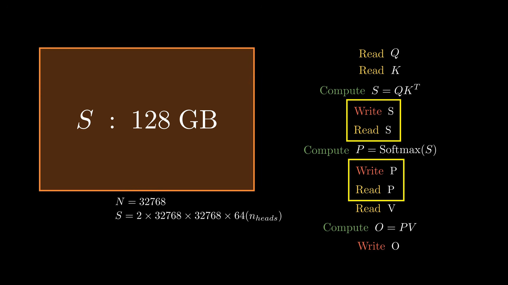
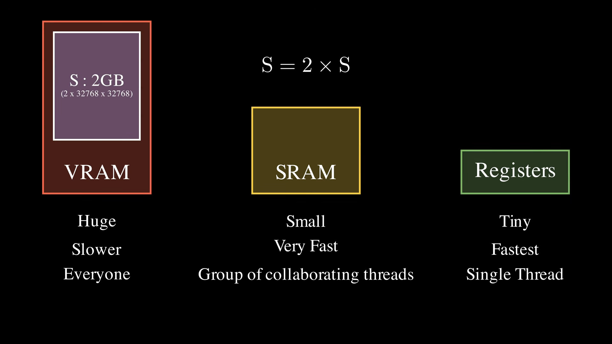
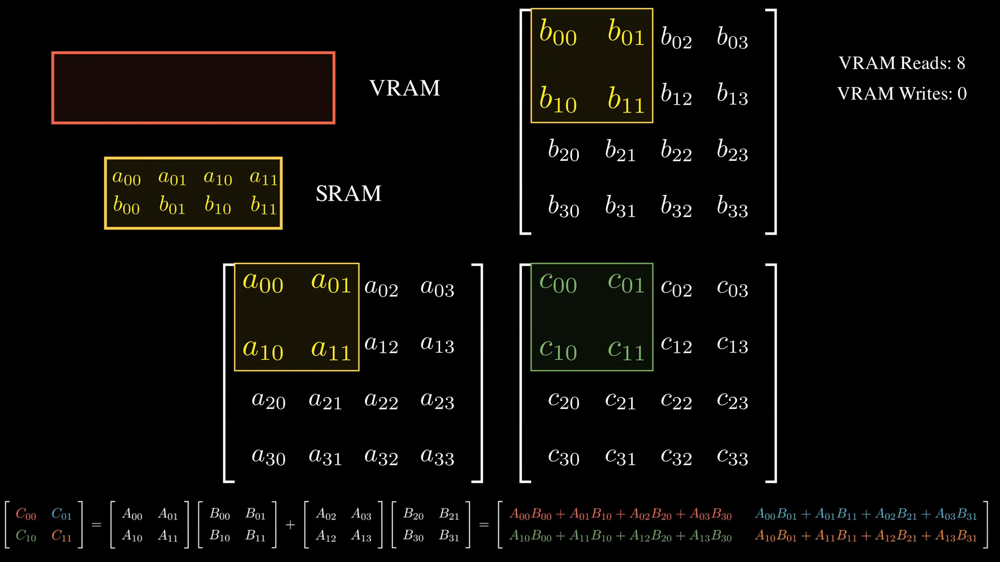
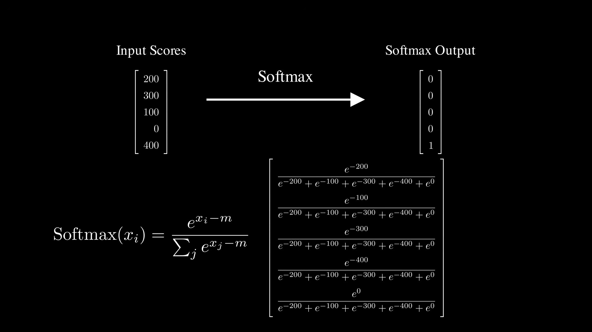
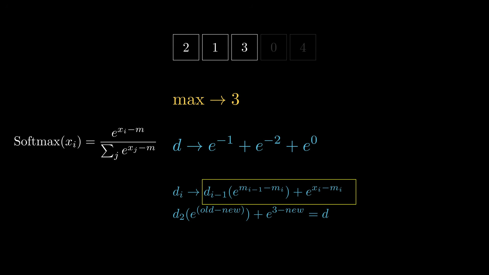
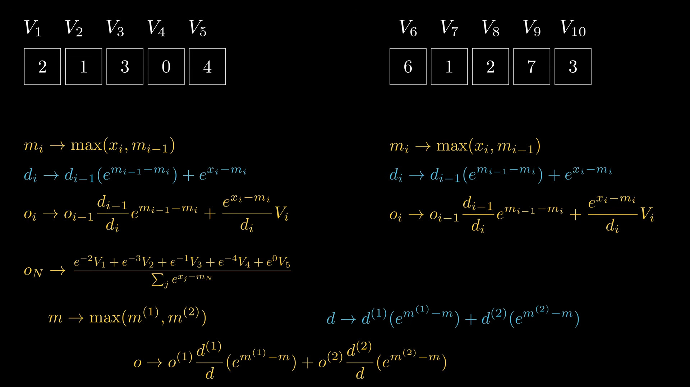

## The problem

## GPU memory

## Tiling

## Safe Softmax

Softmax needs all the the output values to be calculated, so can't tile naively. Instead, we calculate "Online Softmax" - keep track of max (for shift) and sum (for denominator). This minimizes the number of reads from VRAM (from 3N to 2N).  
Even better, we can keep track of a running attention output by directly multiplying the softmax weights by the corresponding values, which helps us avoid writing the softmax scores to VRAM.

## Online (on-the-fly) softmax

## Flash Attention - online calculations
We can keep the running stats of the max, denominator and weighted average (scores * values), and also do these by blocks (not just single entries at a time)
