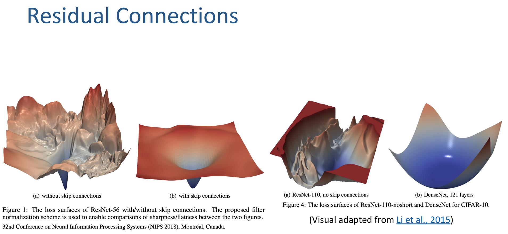

# Appendix E: Q&A from session 1

## Normalization

### Dimensions
- A standard shape of a tensor is $[B,L,D]$ (batch size, sequence length, dimension). 
- BatchNorm normalizes across the $B$ dimension, while LayerNorm and RMSnorm normalize across the $D$ dimension - over all features of a every single token independetly.

- BatchNorm (over $B$) is suboptimal for Language Models because it computes statistics across the batch dimension $B$ for each position and feature. In NLP/LLMs, this fails for three main reasons:
    - **Variable Sequence Lengths**: <mark>Batch statistics become noisy or skewed when sequences in the batch have different lengths and padding.</mark>
    - **Small Batch Sizes during Inference**: During single-sequence autoregressive generation ($B=1$), BatchNorm cannot compute meaningful batch statistics and must rely on running averages. However, <mark>running statistics collected during training often drift significantly from generation-time dynamics in sequence modeling</mark>.
    - **Sequence-Position Dependence**: <mark>BatchNorm maintains separate running statistics for every position along $L$</mark>. This breaks down when sequence lengths during inference exceed those seen during training.

- $L$ is not used (over the tokens in the sequence):
    - **Causality & Autoregressive Generation**: During inference (token-by-token generation), <mark>sequence length $L$ grows dynamically</mark>. If normalization depended on $L$, generating token $L+1$ would alter the statistics and representations of all previously generated tokens $1 \dots L$. Normalizing over $D$ ensures that a token's representation is deterministic and independent of future context, enabling KV caching.
    - **Variable Sequence Lengths & Padding**: Sentences in a batch often have different lengths. If statistics were computed across $L$, <mark>padded positions would distort the mean and variance of actual tokens</mark>, or force complex sequence-masking inside every normalization layer.

- **$D$ represents the latent feature space of a single semantic unit (a token). Normalizing over $D$ regularizes the feature activations of that specific token without blurring distinct tokens together across the temporal sequence. <mark>Within a single token, all feature activations are normalized by the same RMS, and then each is scaled by its own learned $\gamma$ parameter.</mark>**

---
### A concrete example for RMSNorm
Assume a sequence length of $T = 2$ tokens with a hidden dimension $d_{\text{model}} = 3$.
$$\mathbf{x}_1 = [3.0, \; 0.0, \; -4.0] \quad \text{and} \quad \mathbf{x}_2 = [1.0, \; 2.0, \; 2.0]$$
Let's set the learnable gain parameter $\boldsymbol{\gamma} = [1.0, \; 2.0, \; 0.5]$ and $\epsilon = 10^{-5}$

 

Calculation for Token 1 ($\mathbf{x}_1$)Sum of Squares:$$\sum_{i=1}^{3} x_{1, i}^2 = 3.0^2 + 0.0^2 + (-4.0)^2 = 9.0 + 0.0 + 16.0 = 25.0$$
2. Mean Square & Root Mean Square:$$\text{MS}(\mathbf{x}_1) = \frac{25.0}{3} \approx 8.33333$$
$$\text{RMS}(\mathbf{x}_1) = \sqrt{8.33333 + 10^{-5}} \approx \sqrt{8.33334} \approx 2.88675$$
3. Scale Factor ($1 / \text{RMS}$):$$s_1 = \frac{1}{2.88675} \approx 0.34641$$
4. Normalized Vector ($\hat{\mathbf{x}}_1 = s_1 \cdot \mathbf{x}_1$):$$\hat{\mathbf{x}}_1 = [3.0 \cdot 0.34641, \; 0.0 \cdot 0.34641, \; -4.0 \cdot 0.34641] = [1.03923, \; 0.0, \; -1.38564]$$
5. Apply Gain $\boldsymbol{\gamma}$ ($\mathbf{y}_1 = \hat{\mathbf{x}}_1 \odot \boldsymbol{\gamma}$):$$\mathbf{y}_1 = [1.03923 \cdot 1.0, \quad 0.0 \cdot 2.0, \quad -1.38564 \cdot 0.5] = [\mathbf{1.03923}, \; \mathbf{0.0}, \; \mathbf{-0.69282}]$$

---

### Why Pre-LN Prevents Gradient Vanishing 
In Post-LN, the output at layer $l$ involves a nested chain of normalization operators:$$x_L = \text{LN}_L(x_{L-1} + F_{L-1}(x_{L-1}))  

<mark>When computing the Jacobian gradient </mark>$\frac{\partial x_L}{\partial x_l}$<mark> back to early layers, the chain rule forces gradients through the derivative of the LayerNorm operator.</mark>

<mark>Because LayerNorm scales down inputs by </mark>$1 / \sigma_l$<mark>, gradients at early layers are suppressed by a factor proportional to </mark>$\frac{1}{\sqrt{L}}$<mark>.</mark>

Without an extensive learning rate warm-up (or initialization adjustments like Fixup), the updates to early layers early in training are practically zero, leading to severe optimization failure in very deep models.  

In Pre-LN, the residual identity connection provides a direct, unblocked path for gradients:$$x_L = x_0 + \sum_{l=0}^{L-1} F_l(\text{LN}_l(x_l))$$Taking the derivative yields:$$\frac{\partial x_L}{\partial x_l} = I + \frac{\partial}{\partial x_l} \sum_{k=l}^{L-1} F_k(\text{LN}_k(x_k))$$
The identity term $I$ guarantees that gradients flow back to early layers without decay regardless of how large $L$ becomes.

---

### Backward Pass of RMSNorm - Mathematical Derivation  
1. Forward Pass Definition  
Given an input token vector $x \in \mathbb{R}^D$ of hidden dimension $D$:Step 1.1: RMS Scalar ($r$)$$r(x) = \left( \frac{1}{D} \sum_{k=1}^D x_k^2 + \epsilon \right)^{-1/2}$$Step 1.2: Normalized Vector ($\hat{x}$)$$\hat{x}_i = x_i \cdot r$$Step 1.3: Scaled Output ($y$)$$y_i = \hat{x}_i \cdot \gamma_i = x_i \cdot r \cdot \gamma_i$$Where:$\gamma \in \mathbb{R}^D$ is the learnable scaling parameter.$\epsilon$ is a small scalar constant added for numerical stability.During backpropagation, we receive the gradient of the loss $L$ with respect to the layer output, $\frac{\partial L}{\partial y} \in \mathbb{R}^D$. We need to compute:$\frac{\partial L}{\partial \gamma_i}$ (gradient with respect to the learnable gain)$\frac{\partial L}{\partial x_i}$ (gradient with respect to the input vector)  

2. Gradient w.r.t. Gain Parameter ($\gamma$)Using the chain rule for a single element $i$:$$\frac{\partial L}{\partial \gamma_i} = \frac{\partial L}{\partial y_i} \cdot \frac{\partial y_i}{\partial \gamma_i}$$Since $y_i = \hat{x}_i \cdot \gamma_i$, we have $\frac{\partial y_i}{\partial \gamma_i} = \hat{x}_i$:$$\frac{\partial L}{\partial \gamma_i} = \frac{\partial L}{\partial y_i} \cdot \hat{x}_i$$Vectorized Form:$$\frac{\partial L}{\partial \gamma} = \frac{\partial L}{\partial y} \odot \hat{x}$$  
3. Gradient w.r.t. Normalized Input ($\hat{x}$)Using the chain rule on $y_i = \hat{x}_i \cdot \gamma_i$:$$\frac{\partial L}{\partial \hat{x}_i} = \frac{\partial L}{\partial y_i} \cdot \frac{\partial y_i}{\partial \hat{x}_i} = \frac{\partial L}{\partial y_i} \cdot \gamma_i$$Vectorized Form:$$\frac{\partial L}{\partial \hat{x}} = \frac{\partial L}{\partial y} \odot \gamma$$  
4. Gradient w.r.t. RMS Scalar ($r$)Because $r$ is a scalar that depends on all elements $x_k$, any change in $r$ affects every element $\hat{x}_k = x_k \cdot r$. Applying the multivariate chain rule:$$\frac{\partial L}{\partial r} = \sum_{k=1}^D \frac{\partial L}{\partial \hat{x}_k} \cdot \frac{\partial \hat{x}_k}{\partial r}$$Since $\frac{\partial \hat{x}_k}{\partial r} = x_k$:$$\frac{\partial L}{\partial r} = \sum_{k=1}^D \frac{\partial L}{\partial \hat{x}_k} \cdot x_k$$Vectorized Form:$$\frac{\partial L}{\partial r} = \left( \frac{\partial L}{\partial \hat{x}} \right)^T x$$  
5. Gradient w.r.t. Input Vector ($x$)An input element $x_i$ impacts the loss $L$ through two distinct paths:Direct Path: $x_i$ directly scales $\hat{x}_i = x_i \cdot r$.Indirect Path: $x_i$ changes the global scalar $r$, which in turn affects all $\hat{x}_k$.Using the total derivative formula:$$\frac{\partial L}{\partial x_i} = \frac{\partial L}{\partial \hat{x}_i} \cdot \frac{\partial \hat{x}_i}{\partial x_i} + \frac{\partial L}{\partial r} \cdot \frac{\partial r}{\partial x_i}$$Step 5.1: Derivative of Direct Path ($\frac{\partial \hat{x}_i}{\partial x_i}$)Treating $r$ as constant for the local term:$$\frac{\partial \hat{x}_i}{\partial x_i} = r$$Step 5.2: Derivative of Indirect Path ($\frac{\partial r}{\partial x_i}$)Differentiating $r = \left( \frac{1}{D} \sum_{k=1}^D x_k^2 + \epsilon \right)^{-1/2}$ with respect to $x_i$:$$\frac{\partial r}{\partial x_i} = -\frac{1}{2} \left( \frac{1}{D} \sum_{k=1}^D x_k^2 + \epsilon \right)^{-3/2} \cdot \left( \frac{2 x_i}{D} \right)$$Simplifying:$$\frac{\partial r}{\partial x_i} = -\frac{1}{D} \cdot x_i \cdot \left( \frac{1}{D} \sum_{k=1}^D x_k^2 + \epsilon \right)^{-3/2}$$Notice that $r^3 = \left( \frac{1}{D} \sum_{k=1}^D x_k^2 + \epsilon \right)^{-3/2}$. Thus:$$\frac{\partial r}{\partial x_i} = -\frac{1}{D} \cdot x_i \cdot r^3$$Step 5.3: Substitution & SimplificationSubstitute the terms from 5.1 and 5.2 back into the total derivative equation:$$\frac{\partial L}{\partial x_i} = \left( \frac{\partial L}{\partial \hat{x}_i} \right) \cdot r + \left( \frac{\partial L}{\partial r} \right) \cdot \left( -\frac{1}{D} \cdot x_i \cdot r^3 \right)$$Factor out $r$:$$\frac{\partial L}{\partial x_i} = r \cdot \left( \frac{\partial L}{\partial \hat{x}_i} - \frac{1}{D} \cdot x_i \cdot r^2 \cdot \frac{\partial L}{\partial r} \right)$$Rewrite $x_i \cdot r^2$ as $(x_i \cdot r) \cdot r = \hat{x}_i \cdot r$:$$\frac{\partial L}{\partial x_i} = r \cdot \left( \frac{\partial L}{\partial \hat{x}_i} - \frac{\hat{x}_i}{D} \cdot r \cdot \frac{\partial L}{\partial r} \right)$$Substitute $\frac{\partial L}{\partial r} = \sum_{k=1}^D \frac{\partial L}{\partial \hat{x}_k} x_k$:$$\frac{\partial L}{\partial x_i} = r \cdot \left( \frac{\partial L}{\partial \hat{x}_i} - \frac{\hat{x}_i}{D} \cdot r \sum_{k=1}^D \frac{\partial L}{\partial \hat{x}_k} x_k \right)$$Move $r$ inside the summation ($x_k \cdot r = \hat{x}_k$):$$\frac{\partial L}{\partial x_i} = r \cdot \left( \frac{\partial L}{\partial \hat{x}_i} - \frac{\hat{x}_i}{D} \sum_{k=1}^D \left( \frac{\partial L}{\partial \hat{x}_k} \cdot \hat{x}_k \right) \right)$$  
6. Summary of Final Backward Equations  
Gain Gradient ($\gamma$)Scalar Form:$$\frac{\partial L}{\partial \gamma_i} = \frac{\partial L}{\partial y_i} \cdot \hat{x}_i$$Vectorized Form:$$\frac{\partial L}{\partial \gamma} = \frac{\partial L}{\partial y} \odot \hat{x}$$Input Gradient ($x$)Scalar Form:$$\frac{\partial L}{\partial x_i} = r \cdot \left( \frac{\partial L}{\partial \hat{x}_i} - \frac{\hat{x}_i}{D} \sum_{k=1}^D \left( \frac{\partial L}{\partial \hat{x}_k} \hat{x}_k \right) \right)$$Vectorized Form:$$\frac{\partial L}{\partial x} = r \cdot \left( \frac{\partial L}{\partial \hat{x}} - \frac{\hat{x}}{D} \left( \frac{\partial L}{\partial \hat{x}} \cdot \hat{x} \right) \right)$$

***Auxiliary Variables***

Upstream Normalized Gradient:$$\frac{\partial L}{\partial \hat{x}} = \frac{\partial L}{\partial y} \odot \gamma$$RMS Reciprocal:$$r = \left( \frac{1}{D} \sum_{k=1}^D x_k^2 + \epsilon \right)^{-1/2}$$Scalar Projection:$$\left( \frac{\partial L}{\partial \hat{x}} \cdot \hat{x} \right) = \sum_{k=1}^D \frac{\partial L}{\partial \hat{x}_k} \hat{x}_k$$

## FFN vs. Attention - Information Processing
If Attention Modifies Tokens, Why Do We Still Need the FFN?  
While attention pulls information from other tokens, it is inherently limited in what it can actually do with that information.
1. **Attention is Linear Combination (Richer Representation, Same Basis)**  
The attention mechanism computes a weighted soft-lookup:$$\mathbf{a}_i = \sum_{j=1}^{T} A_{i, j} (\mathbf{x}_j \mathbf{W}_V)$$
<mark>This is purely a linear interpolation of existing token features. Attention allows token $i$ to gather context</mark> (e.g., the word "bank" gathering the context word "river"), but <mark>it cannot perform deep non-linear computations or feature transformations on that newly assembled representation</mark>.
2. **Attention collects facts; FFN processes facts**  
Attention (Communication): Moves context vectors across space so that each token has all the relevant facts sitting inside its local vector.  
FFN (Computation & Memory): Operates on that rich, context-infused local vector to compute complex non-linear inferences.
3. **FFNs Act as "Key-Value Memories" for World Knowledge**  
Mechanistic interpretability research shows that FFN layers store the model's factual world knowledge.  
The first projection ($\mathbf{W}_{\text{gate}}$ / $\mathbf{W}_{\text{up}}$) acts as keys: It recognizes specific feature patterns inside the token.  
The second projection ($\mathbf{W}_{\text{down}}$) acts as values: It injects factual updates back into the residual stream.  
Example:  
In the sentence "The capital of France is Paris":  
Attention allows the token "is" to look back and assemble the combined features of "capital", "France", and "is" into a single vector.  
FFN receives this combined vector, fires the internal pattern key for [Concept: Capital of France], and outputs the value vector representing the prediction for "Paris".  
Without the FFN, the Transformer would be a communication network with no internal reasoning engine or memory storage—it could route data between tokens, but could never perform deep non-linear transformations on that data.

---

### How does FFN operate on each token independently?
#### Tensor Dimensions & Notation
Let's define the dimensions used throughout the block:  
- $T$ (Sequence Length): The number of tokens in the input sequence (e.g., $T = 3$).  
- $d_{\text{model}}$ (Hidden Dimension): The vector size representing each token (e.g., $d_{\text{model}} = 4$).  
- $d_{\text{ff}}$ (FFN Intermediate Dimension): The expanded hidden size inside the FFN (e.g., $d_{\text{ff}} = 6$).

The input sequence tensor $\mathbf{X}$ has shape $[T \times d_{\text{model}}]$. Each row corresponds to a single token vector:$$\mathbf{X} = \begin{bmatrix}  \text{---} & \mathbf{x}_1^\top & \text{---} \\  \text{---} & \mathbf{x}_2^\top & \text{---} \\  \vdots & \vdots & \vdots \\  \text{---} & \mathbf{x}_T^\top & \text{---}  \end{bmatrix} \in \mathbb{R}^{T \times d_{\text{model}}}$$Where $\mathbf{x}_t \in \mathbb{R}^{d_{\text{model}}}$ is a column vector representing token position $t$.

Linear Transformation MechanicsA standard linear layer inside the FFN has weight matrix $\mathbf{W} \in \mathbb{R}^{d_{\text{model}} \times d_{\text{ff}}}$.

When the entire sequence matrix $\mathbf{X}$ is multiplied by $\mathbf{W}$:$$\mathbf{H} = \mathbf{X} \mathbf{W} \in \mathbb{R}^{T \times d_{\text{ff}}}$$By standard matrix multiplication rules, row $t$ of output matrix $\mathbf{H}$ (denoted $\mathbf{h}_t^\top$) is derived exclusively from row $t$ of input matrix $\mathbf{X}$ (denoted $\mathbf{x}_t^\top$):

$$\mathbf{h}_t^\top = \mathbf{x}_t^\top \mathbf{W}$$

$$\begin{bmatrix} \mathbf{h}_1^\top \\ \mathbf{h}_2^\top \\ \vdots \\ \mathbf{h}_T^\top \end{bmatrix} = \begin{bmatrix} \mathbf{x}_1^\top \\ \mathbf{x}_2^\top \\ \vdots \\ \mathbf{x}_T^\top \end{bmatrix} \begin{bmatrix} \mathbf{W}_{:, 1} & \mathbf{W}_{:, 2} & \dots & \mathbf{W}_{:, d_{\text{ff}}} \end{bmatrix}$$

Notice that row $\mathbf{x}_2^\top$ is never multiplied by row $\mathbf{x}_1^\top$ or row $\mathbf{x}_3^\top$. Every token vector goes through the exact same matrix $\mathbf{W}$ in complete isolation.

---

## Residual Connections smooth out loss landscapes - Visual Example

## Safe Softmax
### Shifting by max

In softmax implementations, subtracting the maximum value from all input terms (a technique known as the "Max Trick" or Safe Softmax) is done to <mark>ensure numerical stability and prevent overflow errors when computing</mark> $e^x$ <mark>on modern computer hardware.</mark>  
#### The Mathematical Identity  
Mathematically, subtracting a constant $c$ from every term in the softmax input does not change the final output.  
The standard softmax formula for an input vector $x = [x_1, x_2, \dots, x_n]$ is:$$\text{Softmax}(x)_i = \frac{e^{x_i}}{\sum_{j=1}^{n} e^{x_j}}$$If we subtract a constant $c$ from every $x_i$:$$\text{Softmax}(x - c)_i = \frac{e^{x_i - c}}{\sum_{j=1}^{n} e^{x_j - c}} = \frac{e^{x_i} \cdot e^{-c}}{\sum_{j=1}^{n} (e^{x_j} \cdot e^{-c})} = \frac{e^{x_i} \cdot e^{-c}}{e^{-c} \cdot \sum_{j=1}^{n} e^{x_j}} = \frac{e^{x_i}}{\sum_{j=1}^{n} e^{x_j}}$$Because $e^{-c}$ cancels out in both the numerator and denominator, $\text{Softmax}(x - c) = \text{Softmax}(x)$ for any constant $c$.  

#### Why Choose $c = \max(x)$?  
When computers execute $e^x$, floating-point formats (like FP32 or FP16) have strict upper limits on the maximum representable number:  
FP32 limit: $\approx 3.4 \times 10^{38}$ (overflows when $x > 88.7$)
FP16 limit: $\approx 65,504$ (overflows when $x > 11.0$)  

If raw logits $x$ contain even moderate values like $100$, computing $e^{100}$ produces infinity (NaN / Overflow) in standard precision.  
By setting $c = \max(x)$, every adjusted logit $(x_i - \max(x))$ becomes $\le 0$:
Prevents Overflow:   
The maximum shifted input becomes $0$, and $e^0 = 1$. Since all shifted inputs are non-positive ($\le 0$), all exponential terms $e^{x_i - \max(x)}$ are bounded strictly between $0$ and $1$. Exponentials will never overflow.  
Guarantees Non-Zero Denominator:  
Because the largest term becomes $e^0 = 1$, the denominator sum $\sum e^{x_j - c}$ is guaranteed to be at least $1.0$, preventing division-by-zero errors.  
### Numeric Example  
Consider the logits vector 
Naive Calculation:$$e^{1000} \to \text{Overflow (`inf`)}$$
$$\text{Softmax} \to \left[\frac{\text{inf}}{\text{inf}}, \frac{\text{inf}}{\text{inf}}, \frac{\text{inf}}{\text{inf}}\right] = [\text{NaN}, \text{NaN}, \text{NaN}]$$
With Max Trick ($\max(x) = 1002$):$$x - 1002 = [-2, 0, -1]$$
$$e^{x - 1002} = [e^{-2}, e^0, e^{-1}] \approx [0.135, 1.0, 0.368]$$
$$\text{Sum} \approx 0.135 + 1.0 + 0.368 = 1.503$$
$$\text{Softmax} = \left[\frac{0.135}{1.503}, \frac{1.0}{1.503}, \frac{0.368}{1.503}\right] \approx [0.09, 0.66, 0.25]$$

By shifting by the maximum value, the computation stays within valid floating-point bounds while returning the exact correct probability distribution.

### Why Underflow is Usually Harmless in Softmax
In standard attention, if a logit underflows to 0.0:$$\text{Softmax}_i = \frac{e^{x_i - \max(x)}}{\sum e^{x_j - \max(x)}} = \frac{0.0}{\text{Denominator}} = 0.0$$No System Crash: Unlike overflow (which produces inf or NaN and ruins the entire tensor), <mark>underflow gracefully decays to 0.0.</mark>  
Correct Behavior: If a token's logit is drastically smaller than the dominant token's logit (for instance, $x_i = -100$ in FP16), its actual probability contribution is effectively zero. Assigning it an exact weight of 0.0 is mathematically appropriate for attention.  
Safe Denominator: Because the maximum term always becomes $e^0 = 1.0$, the sum in the denominator is always $\ge 1.0$. You can never get a division-by-zero error ($\frac{0.0}{\ge 1.0} = 0.0$).  
#### When Underflow DOES Cause Problems (and How to Fix It)  
Underflow only breaks your code if you take the logarithm of the softmax outputs downstream, which happens during cross-entropy loss computation:$$\text{Loss} = -\log(\text{Softmax}(x))$$If an entry underflows to 0.0, computing $\log(0.0)$ produces -\infty, which immediately ruins your loss and gradients with NaNs.

#### The Fix: Log-Sum-Exp Trick
To avoid underflowing to zero and then taking $\log(0)$, machine learning frameworks never compute torch.log(torch.softmax(x)) separately. Instead, they fuse them using the mathematically equivalent LogSoftmax (Log-Sum-Exp trick):$$\log(\text{Softmax}(x_i)) = (x_i - \max(x)) - \log\left(\sum_j e^{x_j - \max(x)}\right)$$By operating entirely in log-space, you bypass calculating $e^{x_i}$ followed by $\log(\dots)$ altogether, keeping the computation completely immune to both overflow and underflow issues.