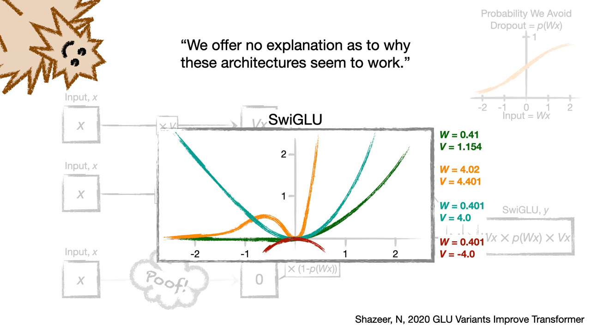
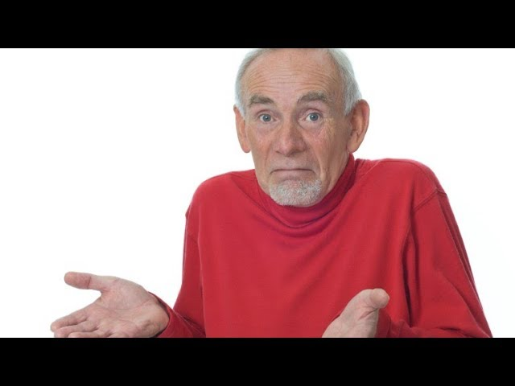
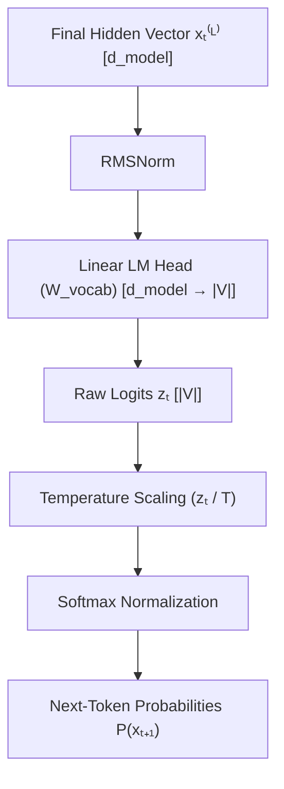
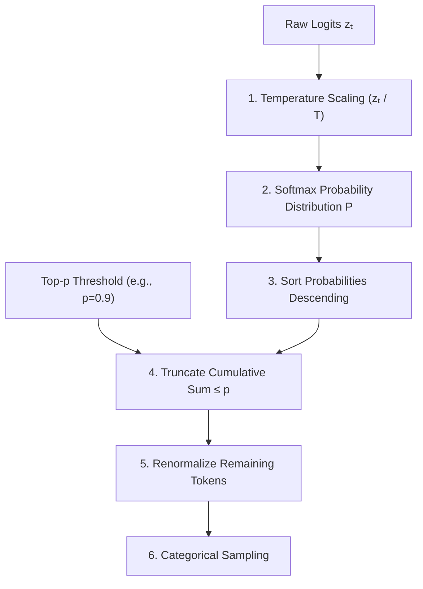
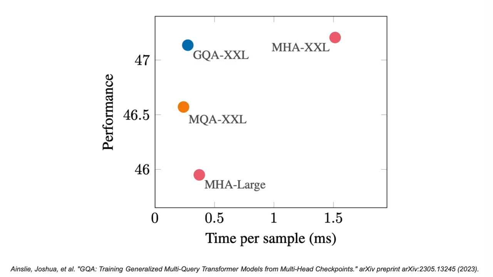
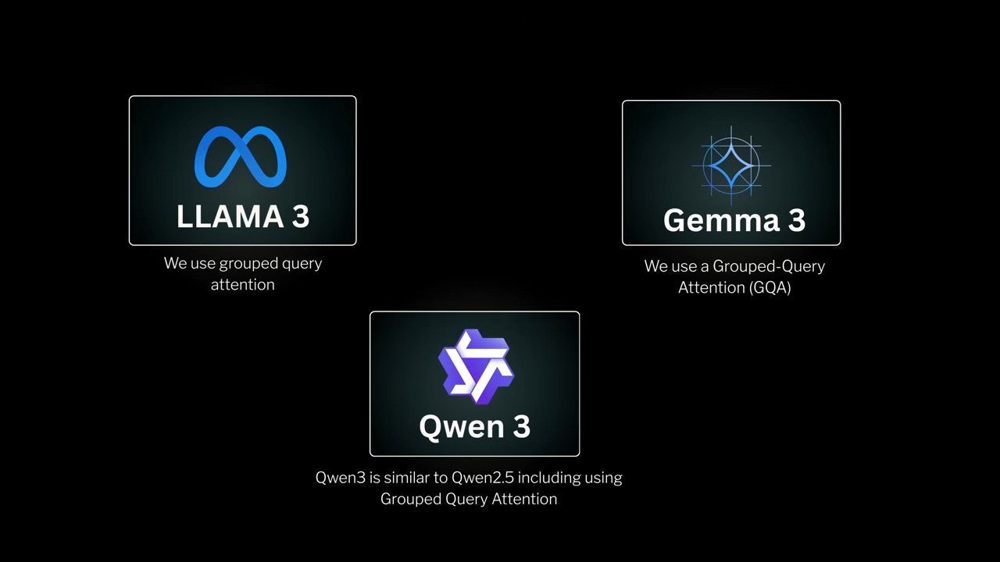

<!-- # Notes: -->

<!-- # MHA
- Multi-head attention conceptually splits each embedding equally among the heads, but in practice, each head is served the full embedding and projects it down to the smaller space.

    - For example: original d_model = 512, num_heads = 8, so each head attends to a 512/8 = 64 sized embedding. Instead of splitting 512 to 8 equal pieces, each 512 is projected down to 64 using 8 matrices. This is done for Q, K and V, so 3*8 matrics, each shaped [512x64].

    - A parallel implementation uses one large matrix [512x512], and the output is split to num_heads equally. -->
<!-- ============================================================================== -->

# **Anatomy of a Real-Life Transformer**

- **Terminology -**
    - *"Transformer Block" - Each one of the Nx modules*
    - *"Transformer Model" - A stack of the Transformer Blocks with an embedding layer and output head.*

- Useful reference: Letitia - https://www.youtube.com/watch?v=BprirYymXrg

## Attention -> Trasnformer Block
After MHA, there is  a projection called W_O that merges the information from the various heads.
Simply concatenating these $h$ outputs produces a tensor of shape $[B, L, h \cdot d_k] = [B, L, d_{\text{model}}]$. However, without a linear projection:
1. **Head Isolation:** Information extracted by head $i$ remains trapped in slice $[i \cdot d_k : (i+1) \cdot d_k]$ and cannot interact with representations learned by head $j$.
2. **Subspace Mixing Deficit:** The model cannot linearly recombine features extracted across different attention perspectives (e.g., combining a syntactic dependency head with a long-range semantic reference head).

### Mathematical Formulation
The concatenated head representations are projected back into the residual space using the output projection matrix $W^O \in \mathbb{R}^{d_{\text{model}} \times d_{\text{model}}}$:

$$\text{MHA}(Q, K, V) = \text{Concat}(\text{head}_1, \text{head}_2, \dots, \text{head}_h) W^O$$

Where:
* $\text{Concat}(\dots) \in \mathbb{R}^{B \times L \times d_{\text{model}}}$
* $W^O \in \mathbb{R}^{d_{\text{model}} \times d_{\text{model}}}$
* Output Tensor $\in \mathbb{R}^{B \times L \times d_{\text{model}}}$

### Concrete Tensor Example
Consider a Llama 3 8B configuration:
* Hidden dimension $d_{\text{model}} = 4096$
* Query heads $h = 32$
* Per-head dimension $d_k = 4096 / 32 = 128$
* Batch size $B = 2$, Sequence length $L = 512$

1. Each head outputs $[2, 512, 128]$.
2. Concatenating across 32 heads yields $[2, 512, 32 \times 128] = [2, 512, 4096]$.
3. Multiplying by $W^O \in \mathbb{R}^{4096 \times 4096}$ mixes feature dimensions across all heads, outputting a tensor of $[2, 512, 4096]$ ready to be added back to the residual stream.

### Residual
In early deep networks, layers transformed representations sequentially ($x^{(l)} = f(x^{(l-1)})$). In ultra-deep architectures (80+ layers), this creates severe vanishing/exploding gradient problems and forces each layer to re-learn identity mappings if no transformation is needed.

The Transformer adopts a **residual stream view**:

$$x^{(l)} = x^{(l-1)} + \text{Attention}(x^{(l-1)}) + \text{FFN}(x^{(l-1)})$$

#TODO - add transformer block diagram

### Mathematical & Gradient Impact
Unrolling the recursion over $L$ layers yields:

$$x^{(L)} = x^{(0)} + \sum_{l=1}^{L} \Delta x^{(l)}$$

During backpropagation, the gradient of the loss $\mathcal{L}$ with respect to the input state $x^{(0)}$ is:

$$\frac{\partial \mathcal{L}}{\partial x^{(0)}} = \frac{\partial \mathcal{L}}{\partial x^{(L)}} \frac{\partial x^{(L)}}{\partial x^{(0)}} = \frac{\partial \mathcal{L}}{\partial x^{(L)}} \left( I + \sum_{l=1}^{L} \frac{\partial \Delta x^{(l)}}{\partial x^{(0)}} \right)$$

The identity term $I$ guarantees that gradients flow backwards through all $L$ layers directly without decaying, eliminating the vanishing gradient wall regardless of depth.

### Normalization

#### Rationale: Stabilization of Activation Distributions
As updates $\Delta x^{(l)}$ are repeatedly added to the residual stream, the variance of the hidden activations scales monotonically with depth ($Var(x^{(l)}) \approx Var(x^{(0)}) + \sum Var(\Delta x)$). Without normalization, deep activations explode, pushing Softmax inputs into saturated zero-gradient regimes.

#TODO - brief LayerNorm explanation

#### Evolution: Post-LN vs. Pre-LN
* **Post-LayerNorm (Original Transformer):** 
  $$x^{(l)} = \text{LN}(x^{(l-1)} + f(x^{(l-1)}))$$
  Gradients passing through the normalization operator in the main residual path are scaled inversely by the norm of the activations. Near the output layer, activations are large, making early layer updates tiny. This required delicate "warm-up" learning rate schedules.
* **Pre-LayerNorm (Modern Standard):**
  $$x^{(l)} = x^{(l-1)} + f(\text{LN}(x^{(l-1)}))$$
  Normalization is placed exclusively on the *branch* leading into the sub-layer. The main residual path remains pure identity, enabling stable zero-warmup training of 100B+ parameter models and larger leraning rates to be used.
    - "the gradients are well-behaved without any exploding or vanishing for the Pre-LN Transformer both theoretically and empirically" (Xiong et al., 2020)

(a) - Post-LN, (b) - Pre-LN

#### RMSNorm (Root Mean Square Normalization) #TODO
Modern LLMs (Llama 3, Mistral, Qwen) replace standard LayerNorm with **RMSNorm** to improve computational speed without sacrificing variance stabilization.

Standard LayerNorm computes both mean $\mu$ and variance $\sigma^2$:

$$\text{LN}(x) = \frac{x - \mu}{\sqrt{\sigma^2 + \epsilon}} \odot \gamma + \beta, \quad \text{where } \mu = \frac{1}{d}\sum_{i=1}^d x_i, \; \sigma^2 = \frac{1}{d}\sum_{i=1}^d (x_i - \mu)^2$$

RMSNorm makes an empirical observation: **the scaling invariance of LayerNorm provides stability, while mean-shifting ($\mu$) provides negligible benefit.** 

By assuming a mean of zero, RMSNorm removes the mean-centering step and the bias parameter $\beta$:

$$\bar{a}_i = \frac{a_i}{\text{RMS}(a)} \odot \gamma_i, \quad \text{where } \text{RMS}(a) = \sqrt{\frac{1}{d} \sum_{i=1}^d a_i^2 + \epsilon}$$

Where:
* $a \in \mathbb{R}^{d_{\text{model}}}$ is the hidden activation vector for a single token.
* $\gamma \in \mathbb{R}^{d_{\text{model}}}$ is a learnable scaling parameter.
* $\epsilon$ is a small constant (e.g., $10^{-5}$) to prevent division by zero.

### FFN 

- The attention mixes information between tokens in the sequence, and the FFN is reponsible for transforming information within the hidden dimension, for each token independently.
- It acts as "Fact Retrieval" - you can think of $w_1$ as a memory Key matrix ($d_{\text{model}} \times d_{\text{ff}}$) where each column represents a pattern detector, $w_2$ is the memory Value matrix, where each row represents a "concept" payload to be injected back into the residual stream.
- For example, during pre-training, when the model is repeatedly forced to predict "Paris" given "capital of France", gradient updates adjust the weights so that: 
    - Column $i$ of $W_1$ aligns closely with the vector  of "capital of France". 
    - Row $i$ of $W_2$ aligns closely with the vector  of "Paris".

### SwiGLU Activation
- Useful References - 
    - https://www.youtube.com/watch?v=2FaI2Fen1mQ
- (These functions help "dropout" in a way that is dependent on the data)
- GELU (Gaussian Error Linear Unit) and SiLU (Sigmoid Linear Unit) are sort of a data-dependent dropout. They are derived by using x*p(x), where p(x) can be any CDF (Guassian and Sigmoid in this case). These two functions are very similar.

{width=2500px}

  

#### Parameter-Matching Strategy for SwiGLU
Standard ReLU FFN uses 2 matrices ($W_{\text{gate/up}}, W_{\text{down}}$) with intermediate dimension $d_{\text{ff}} = 4 d_{\text{model}}$, yielding $2 \times 4 d_{\text{model}}^2 = 8 d_{\text{model}}^2$ parameters.

SwiGLU uses 3 weight matrices ($W_1, W_2, W_3$). To keep total parameters and FLOPs identical to a standard FFN, $d_{\text{ff}}$ is set to $\frac{8}{3} d_{\text{model}}$ (often rounded to the nearest multiple of 256 for GPU alignment):

$$3 \times \left( \frac{8}{3} d_{\text{model}} \times d_{\text{model}} \right) = 8 d_{\text{model}}^2 \text{ parameters}$$

In Llama 3 8B: $d_{\text{model}} = 4096 \implies d_{\text{ff}} = 14336 \approx \frac{8}{3} \times 4096$.

### Result: Full Transformer Block

##  Encoder-Decoder architecture and variants
#TODO 
### Encoder-Only (BERT)
- Attention Mechanism: Unmasked, full Bi-Directional Self-Attention. Every token at position $i$ can attend to all other tokens at positions $j \in [1, L]$ (both past and future).
- Objective: Masked Language Modeling (MLM) or sequence classification.
- Primary Use Case: Producing rich contextual embeddings, feature extraction, passage reranking, and token classification.

### Encoder-Decoder
- The original paper suggested two sub-networks:
    - Encoder which processes the input sequence concurrently, producing keys and values (run once).
    - Decoder which generates the target sequence Y_tgt autoregressively:
        - In the first iteration, it receives a "<START\>" token ("shifted right") and the cached K and V from the encoder, to predict the next single token: T1. In the next step, the decoder receives "<START\> T1" (its own output) and the cached K,V from the encoder, to predict T2. This goes on until the decoder itself predicts <END\>.
        - The Encoder is essentially the "condition" upon which the decoder makes the prediction.
### Decoder-Only (GPT/Llama)
- Attention Mechanism: Causal (Masked) Self-Attention. Token $i$ can attend only to past and current positions $j \le i$.
- No Cross-Attention: Eliminates the Encoder-Decoder attention sub-layer entirely. Each block contains exactly two sub-layers (Causal MHA + FFN).
- Objective: Autoregressive Next-Token Prediction ($P(x_t \mid x_{<t})$).
- Primary Use Case: General-purpose Large Language Models (LLMs), instruction following, and open-ended text generation.

To enforce causality during parallel training and prefill processing, an upper-triangular masking matrix $M \in \mathbb{R}^{L \times L}$ sets future logit positions to $-\infty$ prior to the Softmax operation:

$$
M_{i,j} = \begin{cases}
0 & \text{if } i \ge j \\
-\infty & \text{if } i < j
\end{cases}
$$

$$
CausalAttention(Q, K, V) = \text{softmax}\left(\frac{Q K^T}{\sqrt{d_k}} + M\right) V
$$

When $M_{i,j} = -\infty$, $\exp(-\infty) = 0$, completely blocking information leakage from future tokens $j > i$.

## Language Modeling and Generation #TODO

### LM Head
After passing through all $L$ Transformer blocks, the final hidden state tensor $x^{(L)} \in \mathbb{R}^{B \times L \times d_{\text{model}}}$ represents the fully contextualized sequence representations.

To turn these representations into token predictions, the final vector at the last sequence position $t$, $x_t^{(L)} \in \mathbb{R}^{d_{\text{model}}}$, must be mapped to probability distributions over a discrete vocabulary $V$.

### Softmax & Temperature Scaling
Raw logits $z_t$ are scaled by a scalar **Temperature** parameter $T > 0$ before computing Softmax probabilities:

$$P(x_{t+1} = i \mid x_{1:t}) = \frac{\exp(z_{t, i} / T)}{\sum_{j=1}^{|V|} \exp(z_{t, j} / T)}$$

#### Mathematical Behavior of Temperature $T$:
* **$T \to 0$ (Greedy / Deterministic):** 
    * The maximum logit dominates completely ($P(x_{t+1} = \arg\max z_t) \to 1$). 
    * The model always picks the single most likely token, which leads to repetitive loops, factual rigidity, and generic responses.
* **$T = 1.0$ (Standard Softmax):**
    * Preserves the exact learned probability distribution of the model. 
    * Samples from the full vocabulary long-tail. Extremely low-probability tokens (e.g., typos or rare words) will eventually be sampled, degrading coherence over long generations.
* **$T > 1.0$ (High Entropy / Creative):** 
    * Flattens the logit landscape toward a uniform distribution ($P(x_{t+1}) \to \frac{1}{|V|}$), increasing sample variance and hallucination risk.

#TODO - why would we use this?

### Temperature + Nucleus (Top-$p$) Sampling Mechanics
Nucleus Sampling dynamically adapts the candidate pool based on model confidence:

Dynamic Behavior: When the model is uncertain (e.g., creative writing), probabilities are distributed broadly, so Nucleus sampling keeps many tokens ($k$ is large). When the model is very confident (e.g., factual queries), $P(i_1)$ alone might be $0.92$, so for $p$=0.9, $k=1$ and it automatically acts like greedy decoding!

## LLM Execution Phases
During inference, a Decoder-Only LLM executes in two distinct operational phases that exhibit radically different computational bottlenecks and hardware performance profiles.
### Prefill
- Processing input prompt in parallel. This is done by  Matrix-Matrix multiplications (GEMM) of shape $[B, L_{\text{prompt}}, d_{\text{model}}] \times [d_{\text{model}}, d_{\text{out}}]$.

### Decode
- Generates output tokens serially, one step at a time ($L_{\text{step}} = 1$). The output token from step $t$ becomes the input token for step $t+1$.
- This is done by Matrix-Vector multiplications (GEMV) of shape $[B, 1, d_{\text{model}}] \times [d_{\text{model}}, d_{\text{out}}]$.
- Memory (short) Background:
    - VRAM - main off-chip memory, on which model parameters and KV-cache are stored. Large (80
    GB) but transfer is capped at 3TB/s.
    - SRAM - Ultra-fast memory located directly next to the GPU. Operates at ~10x speed of VRAM, but very small (~50MB total).
- For every single token generated, the GPU must fetch all model weights (e.g., 14-16 GB for an 8B FP16 model) from VRAM into fast SRAM caches. This means the GPU cores are mostly idle, only to perform a tiny number of calculations on a single vector. 

#TODO - context window?
## The Context Window ($C_{\text{max}}$)

## KV Cache:
- Useful References - 
    - https://www.youtube.com/watch?v=7OrMFn86PlM
    - https://www.youtube.com/watch?v=RUlQmkFY4F8
    - https://www.youtube.com/watch?v=gpp57x_z_Jg

- Explain the problem
- How does KV cache help
#TODO - explain + show the concept
#TODO - move all example below to appendix? [appendix_a](appendixA_kvCache.md)
        - $$\text{KV Cache Bytes} = 2 \times b \times s \times l \times h_{kv} \times d_h \times P$$
            Where: 
            - $2$: Accounts for storing both Key ($K$) and Value ($V$) matrices.
            - $b$: Batch size (number of parallel concurrent requests).
            - $s$: Sequence length (total tokens in context + generation).
            - $l$: Number of hidden layers.
            - $h_{kv}$: Number of Key/Value heads per layer.
            - $d_h$: Dimension per head ($d_{\text{head}}$).
            - $P$: Precision size in bytes ($P = 2$ bytes for FP16/BF16, $P = 1$ byte for INT8/FP8).
            - Reference Architecture: Llama-3 70B Benchmark
                - Layers ($l$): 80
                - Query Heads ($h_q$): 64
                - Head Dimension ($d_h$): 128
                - Precision ($P$): 2 bytes (BF16)
                - Context Length ($s$): 8,192 tokens
                - Batch Size ($b$): 16 concurrent sequences
    - Speed improvement
    - Demo pt.1
- What does it cost?
    - Demo pt.2
    

## Optimization Techniques:
- Useful reference: 
    - https://www.youtube.com/watch?v=o68RRGxAtDo
    - https://www.youtube.com/watch?v=_pWigIleZNs

### Multi-Query Attention

#TODO - expand

### Grouped-Query Attention

#TODO - expand

- Should mention?: training with MQA/GQA from scratch is unstable, so authors proposed training on MHA, then converting to MQA/GQA (by mean-pooling K-projections within groups) and finally training for a few steps more. Mean pooling proved better than taking the first key or taking a randomly-selected key from the group.

### DeepSeep improvement??? (https://www.youtube.com/watch?v=9y-0rpEnPrg) - MLA? (Latent Attention) #TODO
- MLA as a low-rank compression technique (compressing $K$ and $V$ into a tiny latent vector $c_t^{KV}$ via joint projection), showing how state-of-the-art architectures compress the cache even further without sacrificing MHA-level representation power.

#### Paged Attention? #TODO
- Problem: Traditional KV cache allocation requires contiguous memory blocks in VRAM per request, leading to severe virtual memory fragmentation (up to 60-80% memory waste).

- Solution: Operates like virtual memory paging in operating systems. It splits the KV Cache into fixed-size physical memory blocks (e.g., 16 tokens per block) allocated dynamically via a lookup page table.

- Impact: Eliminates memory fragmentation, enabling significantly higher batch sizes on fixed GPU hardware.

### Flash Attention? #TODO
- https://www.youtube.com/watch?v=RcFrRqcV4ZA

- The Problem: Standard attention computes $A = \text{softmax}(QK^T / \sqrt{d})V$. Storing that intermediate $N \times N$ attention matrix $A$ in High Bandwidth Memory (HBM) creates an $O(N^2)$ memory footprint and makes attention memory-bandwidth bound rather than compute-bound.
- The Solution: FlashAttention uses tiling (online softmax) to compute attention block-by-block inside fast SRAM on the GPU chip without ever writing the massive $N \times N$ matrix back to HBM.
- The Takeaway: While GQA saves VRAM space, FlashAttention gives you raw wall-clock speedup and exact (non-approximated) attention computation.

# More Cool stuff

### https://hfviewer.com/ - architectures and glossary
- Any model on HuggingFace can be visualized - simply replace the url
    - Transformer Block: https://hfviewer.com/glossary/transformer-block/
    - GQA: https://hfviewer.com/glossary/grouped-query-attention/
    - Qwen3.8-27B: https://hfviewer.com/Qwen/Qwen3.8-27B

# References:
#TODO