

<!-- _class: cover -->
# Anatomy of a Real-Life Transformer

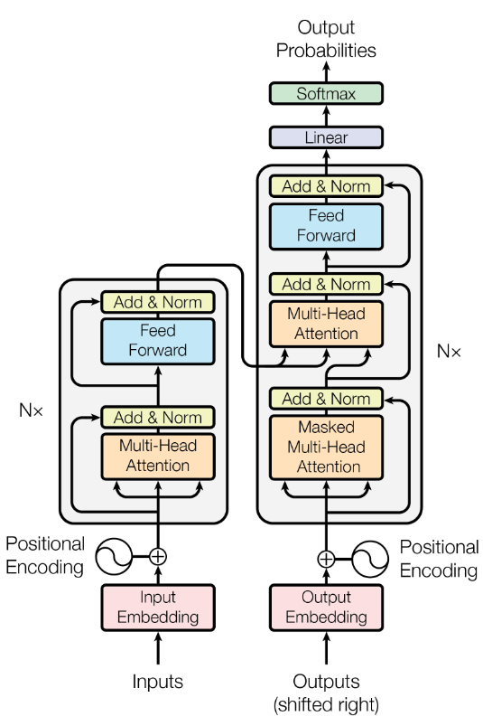

MP Seminar - Sep-15 2026

---

<!-- _class: chapter-roadmap -->

### Chapter Roadmap

1. Attention -> Transformer Block
2. Encoder-Decoder Architecture and Variants
3. Language Modeling and Generation
4. LLM Execution Phases
5. KV Cache
6. The Context Window ($C_{\text{max}}$)
7. Memory Optimization Techniques

---

<!-- _class: section-header -->
## 1. Attention -> Transformer Block

> In the last lecture, we saw how **Self-Attention** and **Multi-Head Attention** allow an embedded 
token to look at other tokens through a single, or multiple independent projection subspaces.
>
> How do we take those outputs, recombine them, push them through a deep network without destroying gradients, and scale this to an 8-billion parameter model that actually generates text?

---

### Output Linear Projection

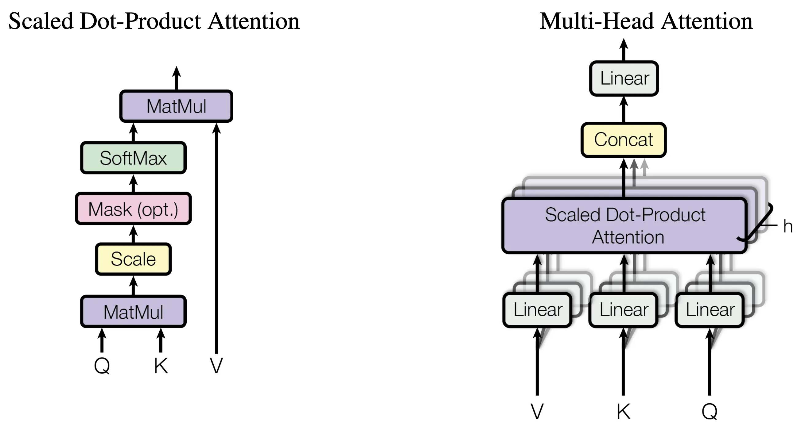

- Last time we ended with $h$ separate outputs of shape $[B, L, d_k]$ Simply concatenating MHA's $h$ outputs produces a tensor of shape $[B, L, h \cdot d_k] = [B, L, d_{\text{model}}]$.
- However, without a linear projection, information extracted by head $i$ remains trappsed and cannot interact with representations learned by head $j$.

So, a new linear projection (termed "output", $w_o$) is added.

---

### A. Output Projection $W^O$: Formula and Worked Example

The concatenated head representations are projected back into the residual space using the output projection matrix $W^O \in \mathbb{R}^{d_{\text{model}} \times d_{\text{model}}}$:

$$\text{MHA}(Q, K, V) = \text{Concat}(\text{head}_1, \dots, \text{head}_h) W^O$$

- $\text{Concat}(\dots) \in \mathbb{R}^{B \times L \times d_{\text{model}}}$
- $W^O \in \mathbb{R}^{d_{\text{model}} \times d_{\text{model}}}$
- Output Tensor $\in \mathbb{R}^{B \times L \times d_{\text{model}}}$

Consider a Llama 3 8B configuration - $d_{\text{model}}=4096$, $h=32$, $d_k=128$, $B=2$, $L=512$:

1. Each head outputs $[2, 512, 128]$.
2. Concatenating across 32 heads yields $[2, 512, 4096]$.
3. Multiplying by $W^O \in \mathbb{R}^{4096 \times 4096}$ mixes feature dimensions across all heads, outputting $[2, 512, 4096]$ ready to be added back to the residual stream.

---

### B. Residual Connections Enable Direct Gradient Flow

In early deep networks, layers transformed representations sequentially ($x^{(l)} = f(x^{(l-1)})$), which causes vanishing/exploding gradients in ultra-deep (80+ layer) architectures.

The Transformer adopts a **residual stream view**:

$$x^{(l)} = x^{(l-1)} + \text{Attention}(x^{(l-1)}) + \text{FFN}(x^{(l-1)})$$

Unrolling over $L$ layers:

$$x^{(L)} = x^{(0)} + \sum_{l=1}^{L} \Delta x^{(l)}$$

During backpropagation, the gradient of the loss $\mathcal{L}$ with respect to $x^{(0)}$ is:

$$\frac{\partial \mathcal{L}}{\partial x^{(0)}} = \frac{\partial \mathcal{L}}{\partial x^{(L)}} \left( I + \sum_{l=1}^{L} \frac{\partial \Delta x^{(l)}}{\partial x^{(0)}} \right)$$

The identity term $I$ guarantees that gradients flow backwards through all $L$ layers directly without decaying, eliminating the vanishing gradient wall regardless of depth.

---

### C. Normalization

#### Rationale: Stabilization of Activation Distributions

- As updates $\Delta x^{(l)}$ are repeatedly added to the residual stream, the variance of the hidden activations scales monotonically with depth ($Var(x^{(l)}) \approx Var(x^{(0)}) + \sum Var(\Delta x)$). Without normalization, deep activations explode, pushing Softmax inputs into saturated zero-gradient regimes.

- **BatchNorm** fails in sequence models because it **relies heavily on batch size** and suffers when dealing with variable sequence lengths and padding tokens-which corrupt cross-batch means and variances.
- **LayerNorm** eliminates batch dependency entirely, providing identical, stable normalization behavior during both training and single-token inference without requiring inter-GPU synchronization during distributed training

- LayerNorm means normalizing **over the layer dimension** in the network. It is regular normalization **over the activation outputs in the layer**, and includes two additional learnable parameters: $\beta$ and $\gamma$, which are additional bias and scale terms, respectively:

$$\text{LayerNorm}(x) = \gamma \odot \frac{x - \mu}{\sqrt{\sigma^2 + \epsilon}} + \beta$$

---

### RMSNorm (Root Mean Square Normalization)

Modern LLMs (Llama 3, Mistral, Qwen) replace standard LayerNorm with **RMSNorm** to improve computational speed without sacrificing variance stabilization.

Zhang and Sennrich (2019) demonstrated that the **primary benefit of LayerNorm comes from scaling** stability (rescaling the magnitude of inputs) rather than mean-shifting. **Dropping mean-centering reduces memory access overhead** and GPU latency while maintaining identical training stability.

Therefore, RMSNorm removes the mean-centering step and the bias parameter $\beta$:

$$\bar{a}_i = \frac{a_i}{\text{RMS}(a)} \odot \gamma_i, \quad \text{where } \text{RMS}(a) = \sqrt{\frac{1}{d} \sum_{i=1}^d a_i^2 + \epsilon}$$

Where:

- $a \in \mathbb{R}^{d_{\text{model}}}$ is the hidden activation vector for a single token.
- $\gamma \in \mathbb{R}^{d_{\text{model}}}$ is a learnable scaling parameter.
- $\epsilon$ is a small constant (e.g., $10^{-5}$) to prevent division by zero.

---

### Evolution: Post-LN vs. Pre-LN

- **Post-LayerNorm (Original Transformer):**

$$x^{(l)} = \text{LN}(x^{(l-1)} + f(x^{(l-1)}))$$

Gradients passing through the normalization operator in the main residual path are scaled inversely by the norm of the activations. Near the output layer, activations are large, making early layer updates tiny. This required delicate "warm-up" learning rate schedules.

- **Pre-LayerNorm (Modern Standard):**

$$x^{(l)} = x^{(l-1)} + f(\text{LN}(x^{(l-1)}))$$

Normalization is placed exclusively on the *branch* leading into the sub-layer. The main residual path remains pure identity, enabling stable zero-warmup training of 100B+ parameter models and larger learning rates to be used.

---

<!-- _class: spacious -->

### Post-LN vs. Pre-LN: Visual Comparison

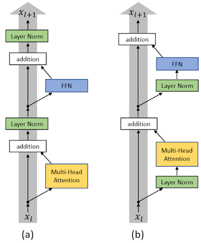

(a) - Post-LN, (b) - Pre-LN

---

<!-- _class: spacious -->

### D. FFN

- The FFN is made of two linear layers (separated by an activation layer):
$$\text{FFN}(x) = \max(0, x W_1 + b_1) W_2 + b_2$$  
- $W_1$ is an expansion (up-projection), typically from $d_{\text{model}}$ to $d_{\text{ff}}$ =  4*$d_{\text{model}}$ and $W_2$ a contraction (down-projection) back to the original size.
- The attention mixes information between tokens in the sequence, and the FFN is responsible for transforming information within the hidden dimension, for each token independently.
- It acts as "Fact Retrieval" - you can think of $w_1$ as a memory Key matrix ($d_{\text{model}} \times d_{\text{ff}}$) where each column represents a pattern detector, $w_2$ is the memory Value matrix, where each row represents a "concept" payload to be injected back into the residual stream.
- For example, during pre-training, when the model is repeatedly forced to predict "Paris" given "capital of France", gradient updates adjust the weights so that:
	- Column $i$ of $W_1$ aligns closely with the vector of "capital of France".
	- Row $i$ of $W_2$ aligns closely with the vector of "Paris".

---

### SwiGLU Gates Features Using a Swish-Activated Branch

GELU (Gaussian Error Linear Unit) and SiLU (Sigmoid Linear Unit) are "data-dependent dropout" (usually derived by using $x*P(x)$, Gaussian CDF and Sigmoid respectively).

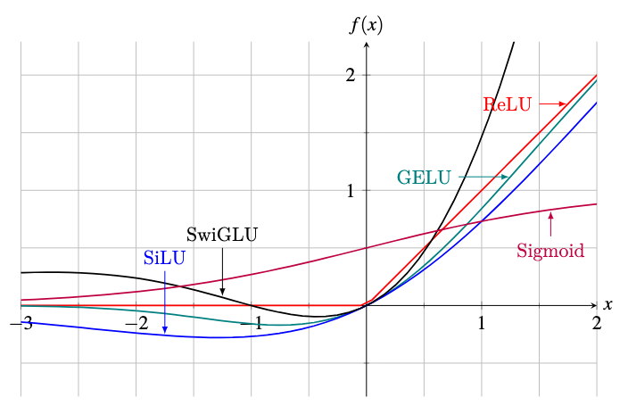

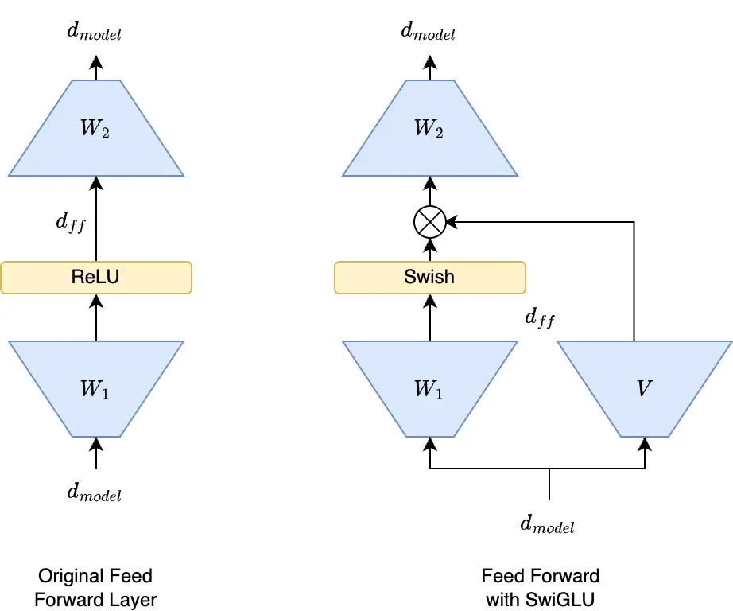

- Two linear projections produce an up branch and a gate branch.
- The gate branch applies Swish/SiLU and modulates the up branch via element-wise multiplication.
- A final down projection maps the gated representation back to $d_{\text{model}}$.

---

### Parameter Matching Keeps SwiGLU Cost Equal to Standard FFN

**Standard ReLU FFN**

Uses 2 matrices ($W_{\text{gate/up}}, W_{\text{down}}$) with intermediate dimension $d_{\text{ff}} = 4 d_{\text{model}}$, yielding:

$$2 \times 4 d_{\text{model}}^2 = 8 d_{\text{model}}^2 \text{ parameters}$$

**SwiGLU**

Uses 3 weight matrices ($W_1, W_2, W_3$). To keep total parameters and FLOPs identical to a standard FFN, $d_{\text{ff}}$ is set to $\frac{8}{3} d_{\text{model}}$ (rounded to the nearest multiple of 256 for GPU alignment):

$$3 \times \left( \frac{8}{3} d_{\text{model}} \times d_{\text{model}} \right) = 8 d_{\text{model}}^2$$

In Llama 3 8B: $d_{\text{model}} = 4096 \implies d_{\text{ff}} = 14336 \approx \frac{8}{3} \times 4096$.

---

### Complete Transformer Model = Embedding + $N$ Blocks + LM Head

- We now have a complete, fully functional Transformer block — with RMSNorm maintaining stability, Multi-Head Attention mixing sequence tokens, and SwiGLU FFN retrieving features.

	$$x^{(l+1)} = x^{(l)} + \text{Attn}(\text{RMSNorm}(x^{(l)})) + \text{SwiGLU}(\text{RMSNorm}(x^{(l)}))$$

- A Transformer model stacks these blocks after token embedding and before the LM head logits projection.

- Model depth lets contextual mixing and feature retrieval accumulate before next-token prediction.

---

<!-- _class: section-header -->
## 2. Encoder-Decoder Architecture and Variants

> To turn this block into an actual model, we have to make two fundamental engineering decisions: 
> How do we stack them? and how do we restrict what each token is allowed to see?

---

### Encoder-Only vs. Encoder-Decoder

**Encoder-Only**

- Attention Mechanism: Unmasked, **full Bi-Directional Self-Attention** (every token at position $i$ can attend to all other tokens at positions $j \in [1, L]$ - both past and future).
- Objective: **Masked Language Modeling** (MLM) or sequence classification.
- Primary Use Case: Producing rich contextual embeddings, feature extraction, passage reranking, and token classification.
- Popular Models: **BERT**, RoBERTa, DeBERTa-v3, ModernBERT, Nomic-BERT.
- Typical Size Range: 100M to 400M parameters (Base $\sim$ 110M–150M, Large $\sim$ 350M–400M). Lightweight for high-throughput inference.

---

**Encoder-Decoder**

- The original paper suggested two sub-networks:
    - **Encoder which processes the input sequence concurrently**, producing keys and values (run once).
    - **Decoder which generates the target sequence** $Y_{tgt}$ autoregressively:
        - In the first iteration, it receives a "<START>" token ("shifted right") and the cached K and V from the encoder, to predict the next single token: T1.
        - In the next step, the decoder receives "<START> T1" (its own output) and K,V from the encoder, to predict T2, and so on.
        - This goes on until the decoder itself predicts <END>.
    - **The Encoder is essentially the "condition" upon which the decoder makes the prediction**.

- Primary Use Case: Sequence-to-Sequence Transformation — Machine translation, abstractive summarization, audio speech-to-text, and document processing.
- Popular Models: T5 / Flan-T5, BART, Whisper (Speech), NMT models.
- Typical Size Range: 60M to 11B parameters (Small/Base: 60M–220M; Large/FLAN: 770M–11B).

---

### Decoder-Only

- **Attention Mechanism: Causal (Masked) Self-Attention**. Token $i$ can attend only to past and current positions $j \le i$.
- Objective: Autoregressive Next-Token Prediction ($P(x_t \mid x_{<t})$).
- Primary Use Case: General-purpose LLMs, conversational AI, code generation, reasoning, instruction following, and open-ended text completion.
- Popular Models: **Llama (Meta), Qwen (Alibaba)**, Mistral/Mixtral, GPT-4 (OpenAI), **Claude** (Anthropic).
- Typical Size Range: 500M to 400B+ parameters (Edge/Mobile: 0.5B–3B; Standard OS: 7B–70B; Frontier LLMs: 100B–400B+).

---
### Decoder-Only: Causal Masking

To enforce causality during parallel training and prefill processing, an upper-triangular masking matrix $M \in \mathbb{R}^{L \times L}$ sets future logit positions to $-\infty$ prior to the Softmax operation:

$$
M_{i,j} = \begin{cases}
0 & \text{if } i \ge j \\
-\infty & \text{if } i < j
\end{cases}
$$

$$
CausalAttention(Q, K, V) = \text{softmax}\left(\frac{Q K^T}{\sqrt{d_k}} + M\right) V
$$

---

<!-- _class: section-header -->
## 3. Language Modeling and Generation

>

> How do we bridge the gap between this continuous hidden vector and a discrete token chosen from a vocabulary of 128,000 words?

---

### LM Head (Unembedding)

After passing through all $L$ Transformer blocks, the final hidden state tensor $x^{(L)} \in \mathbb{R}^{B \times L \times d_{\text{model}}}$ represents the fully contextualized sequence representations.

To turn these representations into token predictions, the final vector at the last sequence position $t$, $x_t^{(L)} \in \mathbb{R}^{d_{\text{model}}}$, must be mapped to probability distributions over a discrete vocabulary $V$.

**LM Head Pipeline**

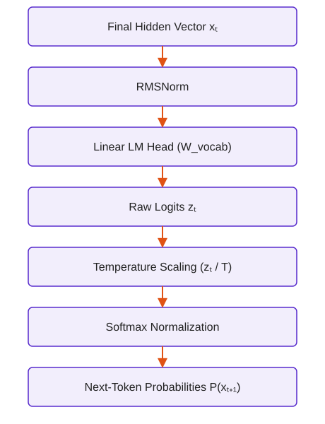

---

### From Logits to Probabilities: Softmax & Temperature

Raw logits $z_t$ are scaled by a scalar **Temperature** parameter $T > 0$ before computing Softmax probabilities:

$$P(x_{t+1} = i \mid x_{1:t}) = \frac{\exp(z_{t, i} / T)}{\sum_{j=1}^{|V|} \exp(z_{t, j} / T)}$$

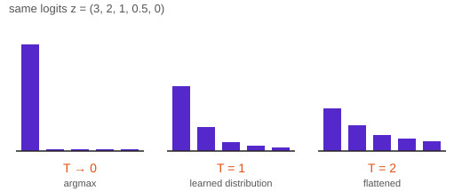

**Mathematical Behavior of Temperature $T$**

- **$T \to 0$ (Greedy / Deterministic):**
	- The **maximum logit dominates** completely ($P(x_{t+1} = \arg\max z_t) \to 1$).
	- The model always picks the single most likely token, which leads to repetitive loops, factual rigidity, and generic responses.
- **$T = 1.0$ (Standard Softmax):**
	- Preserves the exact learned probability distribution of the model.
	- **Samples from the full vocabulary long-tail**. Extremely low-probability tokens (e.g., typos or rare words) will eventually be sampled, degrading coherence over long generations.
- **$T > 1.0$ (High Entropy / Creative):**
	- Flattens the logit landscape toward a uniform distribution ($P(x_{t+1}) \to \frac{1}{|V|}$), increasing sample variance and hallucination risk.

---

### Temperature + Nucleus (Top-$p$) Sampling Mechanics

Nucleus Sampling dynamically adapts the candidate pool based on model confidence:

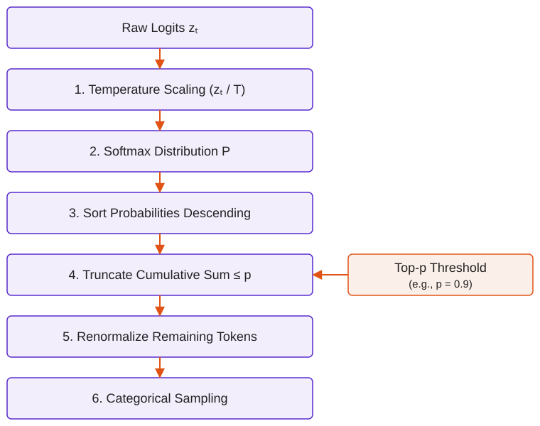

Dynamic Behavior: When the model is uncertain (e.g., creative writing), probabilities are distributed broadly, so Nucleus sampling keeps many tokens ($k$ is large). When the model is very confident (e.g., factual queries), $P(i_1)$ alone might be $0.92$, so for $p=0.9$, $k=1$ and it automatically acts like greedy decoding.

---

<!-- _class: section-header -->
## 4. LLM Execution Phases

During inference, a Decoder-Only LLM executes in two distinct operational phases that exhibit radically different computational bottlenecks and hardware performance profiles.

---

### Prefill vs. Decode:

**Prefill (Prompt Processing)**

- Processing input text in parallel by Matrix-Matrix multiplications (GEMM) of shape $[B, L_{\text{prompt}}, d_{\text{model}}] \times [d_{\text{model}}, d_{\text{out}}]$.
- As this is decoder-only, the attention is causal.
- The output is the set of logits for the **first output token**.
- This stage is very intense compute-wise, utilizing all cuda cores.

**Decode (Autoregressive Token Generation)**

- Generates output tokens serially, one step at a time ($L_{\text{step}} = 1$):
	- The output token from step $t$ becomes the input token for step $t+1$.
	- The decoder performs the attention operation of the new Query with all Keys and Values of all preceding tokens, by Matrix-Vector multiplications (GEMV) of shape $[B, 1, d_{\text{model}}] \times [d_{\text{model}}, d_{\text{out}}]$.

**Decode: Memory Background**

- VRAM - main off-chip memory, on which model parameters and KV-cache are stored. Large (80 GB) but transfer is capped at 3TB/s.
- SRAM - Ultra-fast memory located directly next to the GPU. Operates at ~10x speed of VRAM, but very small (~50MB total).
- For every single token generated, the GPU must fetch all model weights (e.g., 14-16 GB for an 8B FP16 model) from VRAM into fast SRAM caches.
- This means the GPU cores are mostly idle, only to perform a tiny number of calculations on a single vector.

---

<!-- _class: section-header -->
## 5. KV Cache

> This is where we introduce the single most critical data structure in modern LLM inference.

---

<!-- _class: spacious -->

### Useful References for Chapter 5

- https://www.youtube.com/watch?v=7OrMFn86PlM
- https://www.youtube.com/watch?v=RUlQmkFY4F8
- https://www.youtube.com/watch?v=gpp57x_z_Jg

- Explain the problem.
- How does KV cache help.

---
### What's a KV Cache?:

- To compute Attention for that new token, it needs to attend to Query $N+1$ against the Keys and Values of every single preceding token in the sequence—tokens 1 all the way through $N$.

- If we naively recompute the Query, Key, and Value vectors for all $N$ past tokens at every step, our sequence computation scales quadratically at $O(L^2)$. 
	- By the time you reach token 2,000, your GPU is spending 99% of its time recalculating math it already did 1,999 steps ago.

- The solutio: instead of recomputing the past, we save the $K$ and $V$ tensors generated during the Prefill phase, store them in GPU memory, and simply concatenate the new token's Key and Value at every decode step. We trade memory capacity to buy back computational speed.

---

### KV Cache: How much memory do we need?

 
 

$$\text{KV Cache Bytes} = 2 \times b \times s \times l \times h_{kv} \times d_h \times P$$

Where:

- $2$: Accounts for storing both Key ($K$) and Value ($V$) matrices.
- $b$: Batch size (number of parallel concurrent requests).
- $s$: Sequence length (total tokens in context + generation).
- $l$: Number of hidden layers.
- $h_{kv}$: Number of Key/Value heads per layer.
- $d_h$: Dimension per head ($d_{\text{head}}$).
- $P$: Precision size in bytes ($P = 2$ bytes for FP16/BF16, $P = 1$ byte for INT8/FP8).

---

### KV Cache: Reference Architecture (Llama-3 70B)

 
 

$$\text{KV Cache Bytes} = 2 \times b \times s \times l \times h_{kv} \times d_h \times P$$

- Layers ($l$): 80
- Query Heads ($h_q$): 64
- Head Dimension ($d_h$): 128
- Precision ($P$): 2 bytes (BF16)
- Context Length ($s$): 8,192 tokens
- Batch Size ($b$): 16 concurrent sequences

---

<!-- _class: section-header -->
## 6. The Context Window
> Beyond the buzzword.

---

### Context Window ($C_{\text{max}}$)
- The Context Window (or context length, denoted as $L$ or $N$) is the maximum number of tokens an autoregressive Transformer can process in a single forward pass, retain in its attention mechanism, and use to generate the next token.

- This includes both the prompt tokens and previously generated tokens simultaneously. 

- Any token beyond this limit must either be truncated, evicted from memory, or handled via specialized long-context mechanisms.

---
### How does it affect us?

- **Compute bottleneck**: Since attention requires $O(L^2)$ operations (per head), when L doubles, the number of operations quadruples. This mostly has a heavy effect on the prefill phase.

- **Memory bottleneck**: KV cache memory size grows linearly with L.

- **Positional Embeddings**: Absolute and Sinusoidal PE's literally didn't have a term for the L+1 position. As for RoPE, the relative distances are within the trained range (e.g. 4,096), so if L > 4,096, the relative distances (and therefore the rotation angles) are out of distribution.
 
 
 
So - how do we expand the context window?

---

<!-- _class: section-header -->
## 7. Memory Optimization Techniques

• Reduce KV Heads: MQA / GQA
• Hardware/IO Awareness: FlashAttention
• Memory Paging: PagedAttention (vLLM)

---

<!-- _class: spacious -->

### Useful References for Chapter 7

- Deep dives on KV-cache and memory-aware attention kernels.

- https://www.youtube.com/watch?v=o68RRGxAtDo
- https://www.youtube.com/watch?v=_pWigIleZNs

---

### Multi-Query Attention - Google, 2019 (Noam Shazeer*)

- Uses a **single, shared key for all queries**. Afterwards, attention scores are scaled and softmax'd, multiplied by the values and concatenated back - same process as MHA.
- This means that the shared $w_k$ is reposnible for organizing the shared representation space, where different queries can separate the relationships learned by different heads.
- Achieves a 7x speedup in inference time and only 0.3 degradation in perplexity metric (LM benchmark).

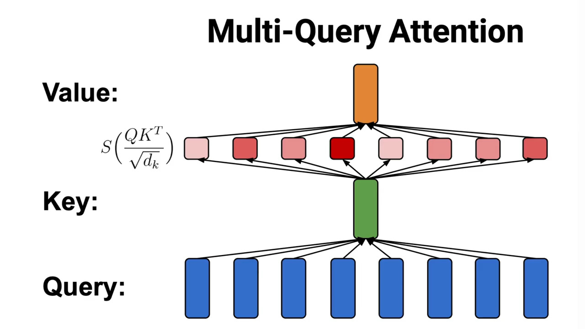

---

### Grouped-Query Attention - Google, 2023

- Defines a *sub-group of queries* that share keys, controlling the trade-off between speed and quality.
 
 

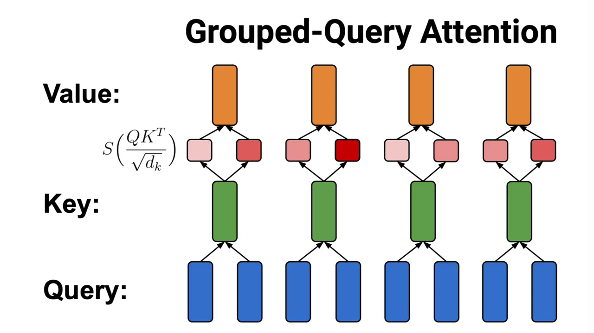

---

### MHA vs. MQA vs. GQA

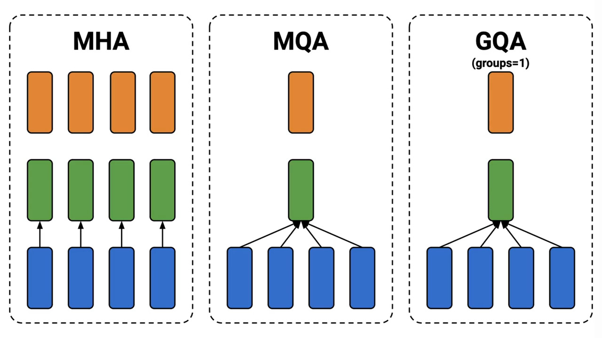

- GQA is essentially as the spectrum between MQA (if #subgroups = H) or vanilla MHA (if #subgroups = 1).

---

<!-- _class: spacious -->

### Training Note (MQA/GQA)

---

<!-- _class: spacious -->

### Multi-Head Latent Attention - DeeppSeek-AI, 2024

- MLA as a low-rank compression technique (compressing $K$ and $V$ into a tiny latent vector $c_t^{KV}$ via joint projection), showing how state-of-the-art architectures compress the cache even further without sacrificing MHA-level representation power.

---

### Paged Attention - UC Berkeley (vLLM Project), 2023

- Problem: Traditional KV cache allocation requires contiguous memory blocks in VRAM per request, leading to severe virtual memory fragmentation (up to 60-80% memory waste).
- Solution: Operates like virtual memory paging in operating systems. It splits the KV Cache into fixed-size physical memory blocks (e.g., 16 tokens per block) allocated dynamically via a lookup page table.
- Impact: Eliminates memory fragmentation, enabling significantly higher batch sizes on fixed GPU hardware.

---

### Flash Attention?

Reference: https://www.youtube.com/watch?v=RcFrRqcV4ZA

- The Problem: Standard attention computes $A = \text{softmax}(QK^T / \sqrt{d})V$. Storing that intermediate $N \times N$ attention matrix $A$ in High Bandwidth Memory (HBM) creates an $O(N^2)$ memory footprint and makes attention memory-bandwidth bound rather than compute-bound.
- The Solution: FlashAttention uses tiling (online softmax) to compute attention block-by-block inside fast SRAM on the GPU chip without ever writing the massive $N \times N$ matrix back to HBM.
- The Takeaway: While GQA saves VRAM space, FlashAttention gives you raw wall-clock speedup and exact (non-approximated) attention computation.

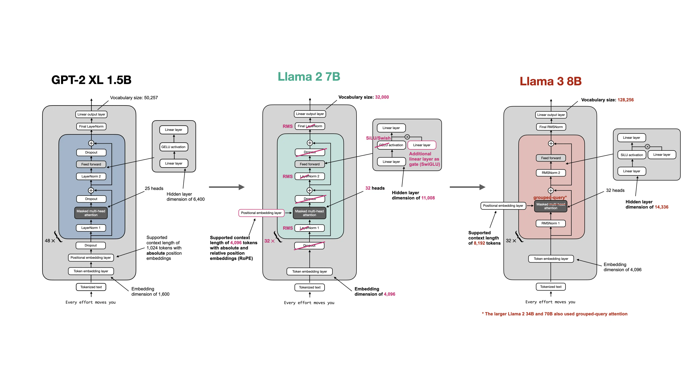

---

<!-- _class: section-header -->
## Note: hfviewer

<!-- _class: spacious -->

### https://hfviewer.com/ - architectures and glossary

- Any model on HuggingFace can be visualized - simply replace the url.
	- Transformer Block: https://hfviewer.com/glossary/transformer-block/
	- GQA: https://hfviewer.com/glossary/grouped-query-attention/
	- Qwen3.8-27B: https://hfviewer.com/Qwen/Qwen3.8-27B

---

<!-- _class: spacious -->

## End-to-End Takeaway: Architecture Meets Hardware Constraints

- We built a modern decoder block from RMSNorm, residual paths, attention, and SwiGLU.
- Stacking blocks gives a decoder-only LM: hidden states become logits, then sampled tokens.
- Inference has two distinct phases: Prefill is compute-bound; Decode is memory-bandwidth-bound.
- The practical bottleneck is not only FLOPs, but also memory movement and cache layout.

### Memory-Aware Kernels Turn the $O(L^2)$ Wall into Throughput

- GQA reduces KV memory by sharing keys/values across query groups.
- MLA compresses KV information into low-rank latent states.
- FlashAttention tiles computation in SRAM and avoids writing full $N \times N$ attention maps to HBM.
- PagedAttention removes VRAM fragmentation through fixed-size block paging.
- Together, these changes make long-context inference production-feasible.

---
